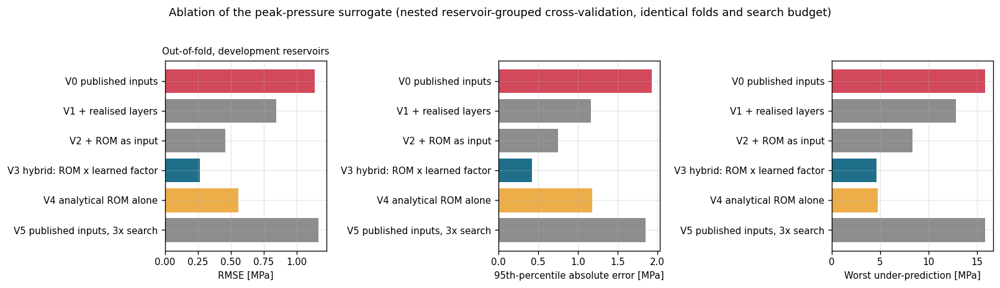
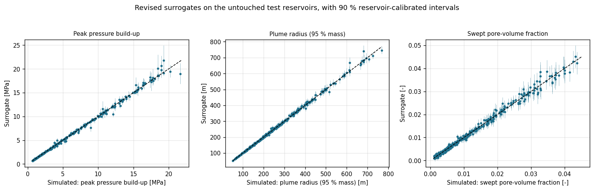
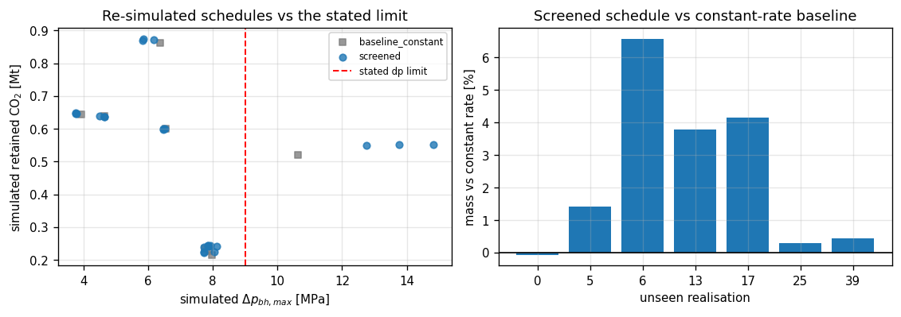
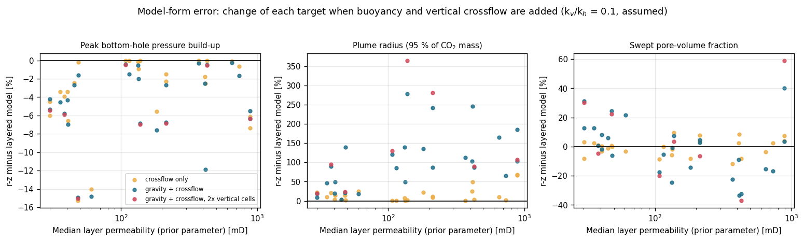

# SubsurfaceML — surrogate-assisted screening of CO₂ injection schedules, with simulator verification

## Supervisor overview

**Question and why it matters.** In a sealed, layered saline aquifer, can a
surrogate trained on simulations predict the peak bottom-hole pressure
build-up of unseen reservoirs well enough, and with honest enough
uncertainty, to screen injection schedules against a pressure limit, with the
simulator confirming every recommendation? In closed aquifers pressure,
rather than pore volume, usually limits storage (Zhou et al., 2008). A
surrogate that fails silently on the reservoirs that matter can make an
unsafe schedule look acceptable.

**What is implemented** (105 tests):
* a radial IMPES CO₂–brine simulator for a sealed four-layer aquifer with one
  shared bottom-hole pressure, passing 21 verification checks, including the
  two-phase well pressure against the pseudo-steady-state solution;
* an analytical reduced-order model (ROM: one sealed tank per realised
  layer), and a **hybrid surrogate** that learns only the ROM's correction;
* reservoir-calibrated conformal intervals and an applicability-domain check;
* **screening that cannot recommend a schedule the simulator has not
  verified**;
* measured discretisation error, and the **model-form error** of omitting
  gravity and crossflow, from a separate radial–vertical model.

**Data and evaluation.** Synthetic data only. Every choice was made on 220
development reservoirs (880 cases) by nested, reservoir-grouped
cross-validation. The choices were frozen in an
[evaluation protocol](docs/EVALUATION_PROTOCOL.md), pushed as commit
`561948e`, *before* 100 fresh test reservoirs and 60 lower-permeability
shift reservoirs were generated and scored once.

**Strongest verified results** (test reservoirs unless stated):

* **Peak build-up RMSE 0.31 MPa**, against 0.70 MPa for the published
  approach retrained on the same reservoirs (ΔRMSE −0.40 MPa, 95 % CI
  [−0.63, −0.18]). Worst under-prediction 2.7 against 6.7 MPa; no
  exceedance of the assumed limit missed (published approach: 2 of 90).
* The published surrogate's large failures had **one cause**: it saw each
  reservoir through its sampling-prior parameters, not the realised layers.
  A three-times larger search did not help.
* Intervals **three times narrower** than the published band (0.55 vs 1.50
  MPa). **Measured coverage**: 95 % of test cases and 86 % of whole test
  reservoirs (nominal 90 %). This is not a guarantee, because the
  calibration reservoirs had helped choose the design. Recalibrated on 41
  fresh reservoirs, by a protocol addendum fixed before the data existed:
  97 % / 91 % at 0.72 MPa. Only for that version, and only for reservoirs
  drawn like the calibration ones, does the conformal argument apply.
* **Every recommendation is simulator-verified.** That is, the layered
  simulator confirms the schedule stays within the *assumed* limits under
  the model's own assumptions; this is not a field-safety check. Shaped
  schedules inject a median 3 % more than the best constant rate for four
  simulations; the published screening loses 10 %. The ROM alone ranks
  schedules as well; the surrogate's value is that its first proposal never
  broke a limit.
* **Outside the training distribution** (60 lower-permeability reservoirs),
  the pressure RMSE rises to 1.95 MPa and the worst under-prediction to
  15.1 MPa. At most 73 % of reservoirs are fully covered by any interval.
  The domain check flags all 60, and the screening falls back to the
  simulator.
* **Error budget.** Discretisation error of the peak build-up: median 0.06 %.
  In 13 % of the shift cases, but in no test case, the recorded peak is a
  well-block start-up transient, 2–14 % too high. Omitting gravity and
  crossflow changes the build-up by −4 % and the plume radius by +88 %.

**Contribution and connection to CO₂ storage.** A reproducible case study
of reliable surrogate-assisted schedule screening: a physics-based ROM with
a learned correction, calibrated by reservoir, tested on reservoirs generated
after the design was frozen, gated by simulation, and set in an error budget
that separates numerical, model-form and surrogate error. No novelty is
claimed for the components ([`docs/SOURCE_MAP.md`](docs/SOURCE_MAP.md) §4).

**Assumptions, limitations, unresolved questions.**
* Synthetic data from assumed priors; no field validation.
* No gravity, crossflow, dissolution, residual trapping or capillary pressure
  in the data, so plume results describe the layered model only. Plume radius
  and swept fraction are grid-dependent (about 4 % and 17 %).
* The 9 MPa build-up and 400 m plume limits are modelling assumptions chosen
  to make the screening bind. They are **not validated fracture-pressure or
  caprock criteria**.
* The most extreme build-up case is still under-predicted by about 15 %.

**Proposed extensions** (not done; [roadmap](docs/REVIEW_CHECKLIST.md#future-work-roadmap-not-started)):
a ROM-ranked fallback for out-of-domain reservoirs; the hybrid on physics
with gravity and crossflow; a finer well block; priors calibrated to a real
formation.

**Where to look.** Key figures:
[ablation](results/study/figures/16_ablation_pressure.png) ·
[parity on test reservoirs](results/study/figures/06_surrogate_parity.png) ·
[errors vs inputs](results/study/figures/08_errors_dp_bh_max_MPa.png) ·
[interval coverage](results/study/figures/18_interval_coverage.png) ·
[screening](results/study/figures/15_schedule_screening.png) ·
[model-form error](results/study/figures/19_model_form_error.png).
All numbers: [`results/study/reports/RESULTS.md`](results/study/reports/RESULTS.md).
Walkthrough notebook: [`notebooks/00_START_HERE.ipynb`](notebooks/00_START_HERE.ipynb)
(install the pinned environment as in [Reproduce](#reproduce); it reads the
saved results and runs in under a minute).
Review recommendations and their status: [`docs/REVIEW_CHECKLIST.md`](docs/REVIEW_CHECKLIST.md).
Full write-up: [`docs/TECHNICAL_REPORT.md`](docs/TECHNICAL_REPORT.md).
Reproduction: [below](#reproduce).

---

## Contents

1. [Model](#model) · 2. [Verification and numerical error](#verification-and-numerical-error) ·
3. [Data and evaluation design](#data-and-evaluation-design) · 4. [Results](#results) ·
5. [Limitations](#limitations) · 6. [Reproduce](#reproduce) · 7. [Files](#files) ·
8. [Version history](#version-history-and-dates) · 9. [Author and attribution](#author-and-attribution)

## Model

One rate-controlled injector sits at the centre of a sealed cylindrical
compartment of four horizontal layers. Within each layer the flow is radial,
isothermal, immiscible two-phase flow of CO₂ displacing brine, solved with
IMPES (implicit pressure, explicit saturation; upstream mobilities, harmonic
transmissibilities, local CFL control with step rejection). All layers share
**one bottom-hole pressure**, solved together with the pressure field, with
injector-only completions. CO₂ mass is conserved to round-off.

| Deliberately left out of the data-generating model | Consequence | Quantified? |
|---|---|---|
| Gravity / buoyancy | no gravity override under the caprock | yes: plume radius +88 % (median), peak build-up −4 % |
| Vertical crossflow between layers | layers communicate only through the well | yes, together with gravity (r–z model) |
| Dissolution and residual trapping | storage security cannot be assessed | no |
| Capillary pressure (`P_c = 0`) | no capillary entry barrier or smearing | no |
| Non-radial geometry, faults, more wells | not a field model | no |

Every assumption that can change a number is in
[`docs/ASSUMPTIONS.md`](docs/ASSUMPTIONS.md).

**Surrogates.** For the peak build-up the hybrid surrogate is
`ln Δp = ln Δp_ROM + g(x)`: the analytical ROM (each realised layer a sealed
pseudo-steady-state tank, one common bottom-hole pressure) times a
correction `g` learned by the course model families in pipelines tuned by
reservoir-grouped randomised search. The plume-radius surrogate uses the
same inputs (published inputs + realised-layer summaries + ROM outputs); the
swept-fraction surrogate keeps the published inputs, because the new inputs
did not help it on development data.

## Verification and numerical error

This is verification — checking that the equations are solved correctly —
not validation against measurements, of which there are none. The pipeline
stops if any check fails; all 21 pass (`results/study/metrics/validation.json`).

| Checks | Result | What it establishes |
|---|---|---|
| Steady radial pressure and the well equation (single-phase solver) | relative error ≤ 5e-13 | transmissibilities and well index assembled correctly |
| Closed-tank material balance | 6e-13 | storage term and sealed boundary consistent |
| Buckley–Leverett / Welge, 100 / 200 / 400 cells | L1 error 0.012 / 0.006 / 0.003; front within 0.5 % | transport converges at first order |
| Radial two-phase: CO₂ mass balance, bounds, no clipping, no odd–even oscillation, step-controller insensitivity | mass error ~1e-15 | IMPES stepping conservative and stable |
| Upscaling limits and bounds; multi-layer well (common BHP, total rate, shut-in) | exact / 0 Pa spread / 2e-14 | upscaling formulae and well coupling correct |
| **V12 / V13 (new)**: two-phase simulator's bottom-hole pressure vs the bounded-reservoir PSS solution, one layer and two commingled layers | 4.3e-7 and 1.2e-4 relative | the quantity the surrogates learn — including units, well index, storage and sealed boundary |

**Discretisation error of the training data** (new). V7 checks convergence
on one verification case; this checks the training targets themselves. 41
development cases (three per permeability tercile × schedule-intensity
quartile, plus five cases singled out in the diagnosis of the published
surrogate) were re-simulated with twice the radial cells, half the
well-block radius and a finer time step — each alone and all together
(`fine`) — and 10 of them with twice that refinement again (`finer`). All
215 runs succeeded and conserve CO₂ mass to 1e-13
(`results/study/metrics/numerics_summary.json`,
[figure 17](results/study/figures/17_numerics_dataset_cases.png)).

| Target | Production vs `fine` (41 cases): median / P90 / max | `fine` vs `finer` (10 cases): median / max | Production vs `finer` (10 cases): median / max |
|---|---|---|---|
| Peak build-up | 0.06 % / 0.48 % / 0.54 % (≤ 0.17 MPa) | 0.03 % / 0.36 % | 0.07 % / 0.91 % |
| Plume radius r95 | 2.7 % / 3.5 % / 4.1 % (≤ 20 m) | 1.6 % / 1.9 % | 4.3 % / 5.3 % |
| Swept fraction | 8.4 % / 15 % / 27 % | 4.2 % / 6.5 % | 17 % / 26 % |

No pressure-limit label changes (0 of 41; one case lies within 5 % of the
limit). For the peak build-up, the quantity the screening relies on, the
numerical error is negligible beside the surrogate error (median relative
error 1.1 %). At production resolution the plume radius is too large by
about 4 % (3–5 %) and the swept fraction by about 17 % (5–26 %), against
the finest level; the radial cell size is the main contributor to both.
For these two targets the surrogates reproduce the production-resolution
simulator more closely than that simulator reproduces the converged
solution, so their numbers describe the production grid.

**Screen of every case for a transient peak** (new). The 41-case sample
cannot show a rare failure mode, so every case was screened. In a sealed
compartment the build-up within a schedule period is largest at its end,
which the stored quarter-yearly series samples. A time-step peak more than
1 % above every stored value therefore marks a transient right after
injection starts or the rate rises, while the well block is still filled
with brine. The height of that transient depends on the well-block size.
Flagged cases were re-simulated at the refined levels
(`results/study/experiments/peak_screen.json`; the test and shift cases were
re-simulated with series, reproducing their stored targets exactly):

| Set | Cases flagged | Peak with all discretisation refined | Pressure-limit labels changed |
|---|---|---|---|
| Development | 4 of 880 (3 reservoirs) | 1.9–12 % lower | 0 |
| Final test | 0 of 400 | — | 0 |
| Shift (median permeability 10–30 mD) | 32 of 240 (20 of 60 reservoirs) | 1.7–14 % lower (median 11 %) | 1 (9.18 → 8.68 MPa) |

Halving the well block alone accounts for almost all of the change (doubling
the radial cells: at most 0.3 %). The error always over-states the peak, so a
simulator check at production resolution errs on the safe side. The reported
test results are unaffected. Re-scored against the refined targets, the
revised surrogate's shift RMSE changes from 1.95 to 1.94 MPa. The
evaluation was not altered after the fact.

## Data and evaluation design

| Role | Reservoirs | Cases | Use |
|---|---|---|---|
| Development — training | 179 | 716 | fitting, tuning, model selection, all development experiments |
| Development — calibration | 41 | 164 | interval calibration (and, with the training reservoirs, the pressure-limit classifier, the domain check's reference set, the permeability-tercile edges and the prior Monte Carlo); they also took part in the development experiments that chose the design |
| **Final test** (fresh, seed 20261104) | **100** | **400** | scored once |
| **Distribution shift** (fresh, seed 20261105; median permeability 10–30 mD instead of 30–1000 mD) | **60** | **240** | scored once |
| Calibration check (fresh, seed 20261106, development prior; generated after the evaluation, protocol addendum) | 41 | 164 | re-calibrating the fixed design's intervals only |

Every split and every cross-validation fold is by whole reservoir. The
published run's 55 test reservoirs had been inspected while this revision
was developed, so they now train, and fresh reservoirs replace them; no id
or reservoir description occurs in two roles. Inputs are built only from
quantities known before simulating (a test builds them with the simulator
disabled). Design choices were made on development data by pre-declared
rules ([protocol](docs/EVALUATION_PROTOCOL.md)).

## Results

### Development experiments (nested reservoir-grouped CV, peak build-up)

| Variant | Out-of-fold RMSE | Worst under-prediction |
|---|---|---|
| V0 published inputs | 1.138 MPa | 15.8 MPa |
| V1 + realised layers | 0.844 | 12.8 |
| V2 + ROM as an input | 0.458 | 8.4 |
| **V3 hybrid (ROM × learned factor) — selected** | **0.266** | **4.6** |
| V4 ROM alone, no learning | 0.559 | 4.7 |
| V5 published inputs, 3× search budget | 1.169 | 15.8 |



### Fresh test reservoirs and distribution shift

| Target | Set | Revised | Published approach, retrained | Published models as released |
|---|---|---|---|---|
| Peak build-up RMSE (worst under-prediction) | test | **0.31 MPa (2.7)** | 0.70 (6.7) | 0.67 (5.5) |
| | shift | 1.95 (15.1) | 3.81 (31.2) | 3.76 (31.5) |
| Plume radius r95 RMSE | test | **6.4 m** | 11.3 | 13.8 |
| | shift | 8.5 | 12.5 | 13.8 |
| Swept fraction RMSE | test | 0.00092 (same model as the published approach) | 0.00092 | 0.00100 |
| Interval, peak build-up: cases / whole reservoirs covered, mean width | test | **95 % / 86 %, 0.55 MPa** | 90 % / 85 %, 1.50 MPa | 90 % / 83 %, 1.50 MPa |
| | shift | 80 % / 70 %, 1.15 MPa | 47 % / 23 %, 1.37 MPa | 47 % / 22 %, 1.36 MPa |
| Same interval recalibrated on 41 fresh reservoirs (protocol addendum, subsequent evaluation) | test | 97 % / 91 %, 0.72 MPa | — | — |
| | shift | 84 % / 73 %, 1.50 MPa | — | — |

All coverages are measured on the independent sets. The original intervals'
calibration reservoirs had taken part in choosing the design, so no
finite-sample guarantee is claimed for them. The recalibration
(`results/study/experiments/calibration_check.json`) refits nothing and
leaves the original results and the saved models unchanged.
`subsurfaceml predict` reports the original interval.

Paired reservoir bootstrap, revised minus published approach (peak build-up
RMSE): test −0.40 MPa [−0.63, −0.18]; shift −1.86 MPa [−2.75, −0.97]. In
the low-permeability tercile of the test set: 0.47 vs 1.03 MPa.



### Verification-gated screening (budget 4 simulations per reservoir)

| Method | Test (20 reservoirs): verified · first proposal violated · median mass vs best constant rate | Shift (10): verified · median mass |
|---|---|---|
| simulator-only constant rate (baseline) | 20/20 · 0 · 0 % | 10/10 · 0 % |
| published screening, no repair | 19/20 · 1 · −9.6 % | 9/10 · −11.8 % |
| ROM-ranked schedules + repair (control) | 20/20 · 5 · +3.4 % | 10/10 · +11.1 % |
| **revised verified screening** | **20/20 · 0 · +2.9 %** | 10/10 · +0.0 % (out of domain → simulator fallback) |



### Model-form error (r–z model with gravity and crossflow, 26 development cases)

Peak build-up −4.3 % (median; −9.7 to −0.5 % P10–P90); plume radius +88 %
(+19 to +213 %); 1 of 26 pressure-limit labels changes. `k_v/k_h = 0.1` is
assumed; doubling the vertical resolution makes the plume change larger.



## Limitations

* **Synthetic data, assumed priors**; no field data, history match or field
  validation. The shift test changes one prior range only.
* **Physics of the data**: no gravity or crossflow (their effect is measured,
  not removed), no dissolution, residual trapping, capillary pressure,
  temperature or geomechanics; radial symmetry, one well. Plume-radius
  results describe the layered model only.
* **Grid dependence**: at production resolution the plume radius is about
  4 % and the swept fraction about 17 % too large (against the finest level
  tested); the surrogates learn the production grid. The peak build-up is
  converged to within 1 %, except where it is a start-up transient (13 % of
  the low-permeability shift cases, 0.5 % of development cases): there it is
  2–14 % too high.
* **Limits** (9 MPa build-up, 400 m plume radius) are modelling assumptions.
* **Intervals**: the pipeline's intervals (also the ones `subsurfaceml
  predict` reports) have measured coverage only, 86 % of whole test
  reservoirs for a nominal 90 %. Their calibration reservoirs took part in
  choosing the design. After recalibration on 41 fresh reservoirs, the
  conformal statement holds on average over calibration draws, for
  reservoirs drawn like the calibration reservoirs, with their four sampled
  schedules. It does not hold for a shifted population, or for the
  thousands of screened candidates.
* **Tail**: the most extreme build-up case (32 MPa) is under-predicted by
  about 15 % in development cross-validation; the ROM's residual there
  cannot be learned from one case.
* **Screening gains are small** (a few per cent) and were obtained with the
  plume constraint evaluated by the layered model.
* **Design**: schedules are scaled by a permeability-dependent reference
  rate, so rate and permeability are correlated by construction.
* **Saved models** load only with the scikit-learn version recorded in their
  manifest.

## Reproduce

Python 3.11 with the pinned versions (the saved models are tied to the
scikit-learn version in their manifest):

```bash
git clone https://github.com/abdelghafarfouda/manchester-msc-projects.git
cd manchester-msc-projects/advanced-subsurface-modelling/SubsurfaceML
python -m venv .venv && source .venv/bin/activate     # Windows: .venv\Scripts\activate
python -m pip install -r requirements-lock.txt
python -m pip install -e . --no-deps
```

The complete study, in the order it was run. Seeds are fixed in the
configuration files: development data 20260909, final test 20261104, shift
20261105, calibration check 20261106, model selection 0. Runtimes were measured on a 4-core Linux virtual
machine (Intel Xeon 2.1 GHz, 15 GB RAM) using all cores.

| Step | Command | Runtime |
|---|---|---|
| 1. Development experiments: ablation, interval selection, decisions | `python scripts/run_experiments.py --config config/study.yaml --only ablation` | 71 min |
| 2. Full pipeline: verification → development data → fresh test sets → discretisation study → surrogates → evaluation → screening → report | `python scripts/run_pipeline.py --config config/study.yaml` | 66 min |
| 3. Model-form error (r–z model) | `python scripts/run_model_form.py --config config/study.yaml` | 16 min |
| 4. Screen of all 1,520 cases for transient peaks | `python scripts/run_experiments.py --config config/study.yaml --only peak_screen` | 7 min |
| 5. Calibration check: the fixed design recalibrated on 41 fresh reservoirs (protocol addendum) | `python scripts/run_experiments.py --config config/study.yaml --only calibration_check` | 2 min |
| 6. Notebooks (rebuild and execute) | `python scripts/make_notebooks.py --execute` | 36 s |
| Tests | `pytest` (105 tests) | 2 min |
| Small demo of the whole pipeline | `python scripts/run_pipeline.py --config config/demo.yaml` | 12 min |

Step 1 needs the development data (`results/study/data/scenarios.csv`), which
step 2 writes; the published copy is what the pipeline regenerates (identical
in every simulated value), so the order shown is the order used. Running the
pipeline twice from clean data gave identical machine-learning, interval and
screening results. Re-running step 1 reproduced every design decision, with
out-of-fold RMSEs within 0.014 MPa of the recorded ones
(`results/study/experiments/ablation_reproduction.json`): its inputs, read
from `scenarios_features.csv` rather than rebuilt from `scenarios.csv`, differ
in the last digits (≤ 2e-13 relative), which tips near-tied model choices in
the hyper-parameter searches. A pipeline run overwrites its configuration's folder in
`results/` except `experiments/`. Other entry points:
`subsurfaceml predict --config config/study.yaml --input examples/worked_example_input.json`,
`subsurfaceml simulate`, `subsurfaceml validate`, and
`streamlit run app/streamlit_app.py -- --config config/study.yaml`.

## Files

```
notebooks/00_START_HERE.ipynb      the walkthrough (entry point)
notebooks/supporting/              s1 sources · s2 simulator verification · s3 ML methods · s4 screening · s5 worked example
src/subsurfaceml/                  simulator (impes, grid, fluids), rom, hybrid, features, models, intervals,
                                   domain, screening, numerics, rz, final_eval, experiments, pipeline, figures
scripts/                           run_pipeline.py · run_experiments.py · run_model_form.py · run_validation.py · make_notebooks.py
config/                            study.yaml (reference run) · demo.yaml (small run)
results/study/                     data (development + fresh test + shift), figures, metrics, models, report, experiments/
results/demo/                      the small run, same layout
results/published_2026-09-20/      the published models (hash-checked) and the reproduction record of the published run
tests/                             105 tests
app/streamlit_app.py               optional interface: predict, simulate, verified screening
docs/                              REVIEW_CHECKLIST · EVALUATION_PROTOCOL · TECHNICAL_REPORT · WALKTHROUGH · SOURCE_MAP · ASSUMPTIONS ·
                                   MAPPING_TABLE · CHANGELOG · archive/ (2026-09-20 course-coverage record)
```

## Version history and dates

| Version | Date | What it is |
|---|---|---|
| Module project | during the MSc (CHEN60482 *Advanced Subsurface Modelling*) | the original coursework project |
| Corrected version | 2026-09-20, published 2026-09-27 | defects found and fixed, scoped to the course material, 880-case study run (`docs/CHANGELOG.md`) |
| **This revision** | **2026-10-04** | extended and re-verified after two portfolio reviews: the analysis and results described above |
| Completion pass | 2026-10-04 | calibration check on fresh reservoirs (protocol addendum), experiment inputs from one source, corrected coverage and data-role statements, review checklist; no pipeline result changed (`docs/CHANGELOG.md`) |

The versions on GitHub were extended and re-verified in September and
October 2026, after the module was completed. The published 2026-09-20 study
run was reproduced end to end before any change (all 2,961 recorded values
identical; `results/published_2026-09-20/baseline_reproduction.json`), and
its models are kept, hash-checked, in `results/published_2026-09-20/` so that
they can be scored on the new test reservoirs.

Of the two reviews that prompted this revision, only the English review
("Portfolio Quick Review", 4 October 2026) was available while the work was
done; the Arabic version was not supplied, so any recommendation that
appears only in it has not been addressed.

**The published 2026-09-20 study run** generated 880 cases (220 reservoirs ×
4 schedules) and split them by reservoir into 124 training, 41 calibration
and 55 test reservoirs (496 / 164 / 220 cases); its peak-pressure surrogate
(SVR) scored a test RMSE of 1.24 MPa (R² 0.94) on those 55 reservoirs, its
error band covered 88 % of test cases, and one of eight screened test
reservoirs (reservoir 36) broke the assumed limit in every screened schedule
when re-simulated. Those numbers are reproduced exactly by the published
code and are superseded by the results above.

## Author and attribution

Abdelghafar Fouda. The original project was developed by the author for the
MSc module CHEN60482 *Advanced Subsurface Modelling* at the University of
Manchester. Its physics, numerical methods and machine-learning methods
follow the CHEN60482 course materials (lectures by Dr Masoud Babaei;
uncertainty material by Dr Lin Ma) and the accompanying *Data Science and
Machine Learning* notebooks, as traced in
[`docs/SOURCE_MAP.md`](docs/SOURCE_MAP.md) §1–3; no course material is
redistributed here. Components added in October 2026 that come from outside
the course material are listed with their primary sources in §4 of the same
file.

AI assistance: the versions published here were produced after the module.
AI assistance was used substantially in writing, correcting, testing and
documenting the code of the 2026-09-20 version (`docs/CHANGELOG.md`), and
the October 2026 revision — the diagnosis, the new modules, the experiments,
the results and this documentation — was implemented with an AI coding
assistant (Claude, Anthropic) at the author's direction. Every number in
this README is read from files in `results/` produced by the code in this
repository.

The code uses NumPy, SciPy, pandas, scikit-learn, Matplotlib, joblib, PyYAML,
XGBoost, SHAP, imbalanced-learn, scikit-optimize, umap-learn and Streamlit,
all under permissive open-source licences (BSD, MIT or Apache 2.0;
Matplotlib under its own PSF-style licence).

Licence: MIT (see [`LICENSE`](LICENSE)).

### References

Zhou, Q., Birkholzer, J.T., Tsang, C.-F. & Rutqvist, J. (2008). A method for
quick assessment of CO₂ storage capacity in closed and semi-closed saline
formations. *Int. J. Greenhouse Gas Control* 2, 626–639. Further references:
[`docs/TECHNICAL_REPORT.md`](docs/TECHNICAL_REPORT.md).
