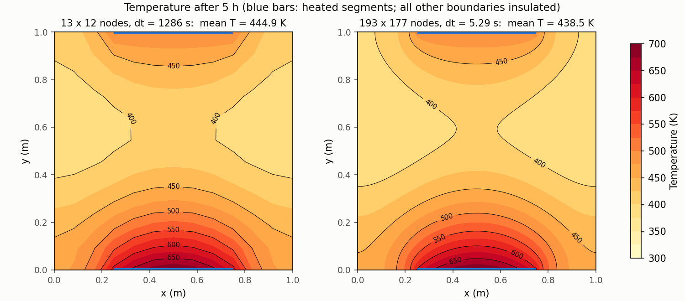
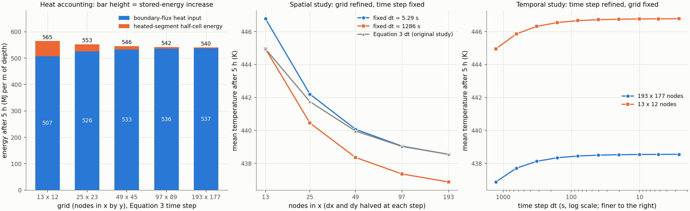
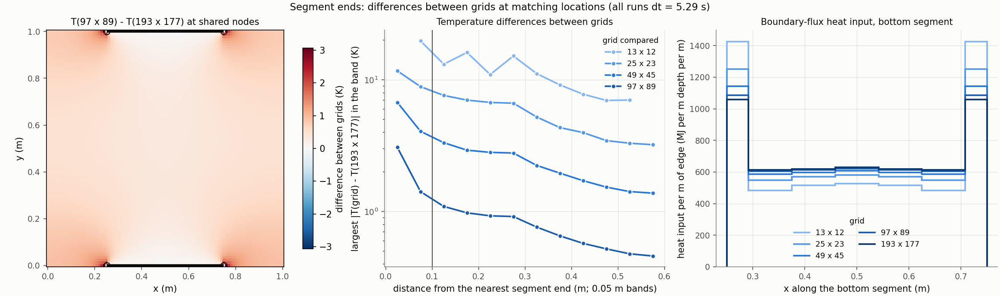
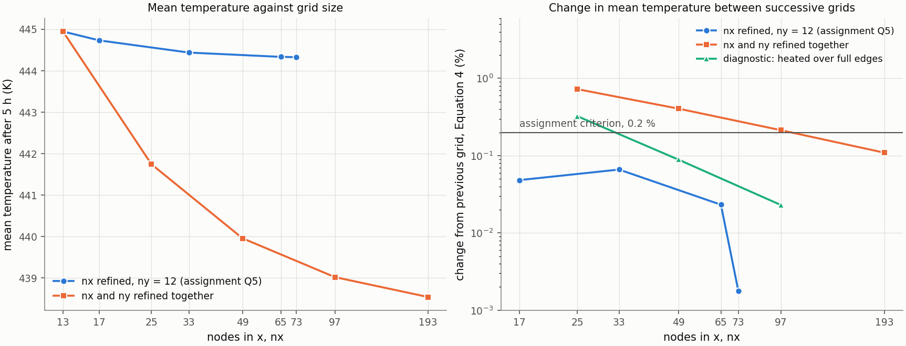
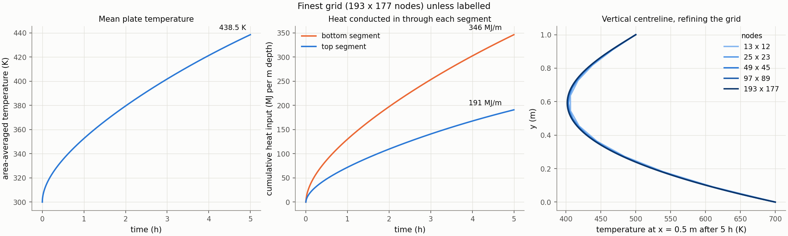
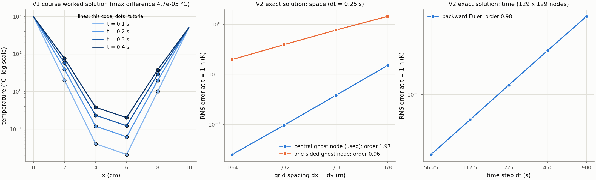

# Transient heat conduction in an anisotropic plate

## Supervisor overview

**Question and set-up.** A 1 m × 1 m plate, initially at 300 K, is heated for
5 h through two centred boundary segments, each half the plate width: the top
one is held at 500 K and the bottom one at 300 sin(πx/L) + 400 K. The rest of
the boundary is insulated. The conductivity differs in x and y (kx = 16,
ky = 20 W m⁻¹ K⁻¹; ρ = 7800 kg m⁻³, cp = 500 J kg⁻¹ K⁻¹). What are the
temperature field, the mean temperature and the heat taken in after 5 h, and
how much do they depend on the grid and the time step? All inputs come from
the module's Assignment (3); the problem is a numerical exercise, not a
model of any real rock or geothermal system.

**Method and verification.** Five-point central differences, a mirrored ghost
node on insulated edges, and backward Euler in time with one sparse LU
factorisation per run. Five checks (six recorded passes) verify the code: the
course's worked rod solution (V1); an exact solution of a smooth problem, with
order 1.97 in space and 0.98 in time (V2); energy conservation to 5 × 10⁻¹²
(V3); units (V4); and an exact discrete solution with Δx ≠ Δy that catches an
exchange of αx and αy (V5). This is verification, not validation: no
measurements exist for this problem.

**Main measured findings** (energies in MJ/m, i.e. per metre of out-of-plane
depth; the 193 × 177 grid is the most refined result, not an exact answer):

* After 5 h the mean temperature is 438.5 K on 193 × 177 nodes and 444.9 K
  on the assignment's 13 × 12 grid, a difference of +6.4 K (+1.5 % of 438.5
  K, +4.6 % of the 138.5 K rise).
* **Grid and time step pull in opposite directions.** At a fixed time step
  of 5.29 s, the coarse grid alone raises the mean temperature by +8.23 K;
  the coarse grid's own time step (1286 s) lowers it by −1.83 K. Splitting
  the other way round gives +8.08 K and −1.68 K: the two effects are not
  exactly additive (interaction −0.15 K).
* Under spatial refinement alone the mean temperature changes by −4.57,
  −2.13, −1.02 and −0.50 K, about first order in the grid spacing. Under
  time-step refinement alone it is first order in Δt (ratios 1.98–2.00),
  as expected of backward Euler.
* The largest temperature differences between grids lie at the insulated
  nodes next to the heated-segment ends: 3.07 K between 97 × 89 and
  193 × 177, against at most 1.09 K more than 0.1 m from an end. They halve
  with each refinement away from the ends, but shrink only about 1.5 times
  near them. Coarse grids also put more heat in through the segment ends and
  less along the rest of each segment.

**Heat-input accounting.** Two different quantities must not be confused. The
*boundary-flux heat input*, conducted from the heated nodes into the rest of
the plate, is 507.3 MJ/m on 13 × 12 against 537.1 on 193 × 177 (−5.5 %). The
*stored-energy increase*, which the mean temperature measures, is 565.3
against 540.3 MJ/m (+4.6 %). They differ by the energy of the heated nodes'
own half-cells, held at the boundary temperature from t = 0: 58.0 MJ/m on
13 × 12 and 3.2 MJ/m on 193 × 177, proportional to the grid spacing. So the
−5.5 % is not the grid effect on stored energy: the coarse grid stores 4.6 %
*more*.

**Limitations and scope.** The conclusions hold for this plate, its
assignment properties, and conduction in 2-D. The grid differences are
differences between numerical results; no error bound is claimed for the
193 × 177 values, and no extrapolation method is used, because none is in
the course material. The plate results change at about first order in the
grid spacing; the second-order evidence (V2) applies only to the smooth test
problem. The measurements point to the mixed boundary conditions at the four
segment ends as the reason, but the local mechanism is not analysed.

**Where to look.** Full derivations and every table:
[docs/WALKTHROUGH.md](docs/WALKTHROUGH.md) (sections 3.8 and 7 cover this
revision). Review recommendations and where each was addressed:
[docs/REVIEW_CHECKLIST.md](docs/REVIEW_CHECKLIST.md). Sources:
[SOURCE_MAP.md](SOURCE_MAP.md). To run: `python run_project.py` (original
study and checks V1–V5, about 1 min) and `python run_studies.py` (revision
studies, about 1.5 min); see [Run it](#run-it).

---

## Question

A 1 m x 1 m plate is initially at 300 K. Its conductivity is anisotropic (kx = 16,
ky = 20 W m⁻¹ K⁻¹), with ρ = 7800 kg m⁻³ and cp = 500 J kg⁻¹ K⁻¹. It is heated for
5 h through two centred boundary segments, each half the plate width. The top
segment is held at 500 K and the bottom one at 300 sin(πx/L) + 400 K; every other
boundary is insulated.

**What are the temperature field, the mean temperature and the heat conducted into
the plate after 5 h, and how fine must the grid be before the mean temperature
changes by less than the course's 0.2 % criterion?** The October 2026 revision adds:
**how much of the grid dependence comes from the grid spacing and how much from the
time step, and where on the plate do the grids differ?**

## Source and scope

The problem is Assignment (3) of an MSc module in numerical modelling and
simulation, solved with methods from that module and from the accompanying
*Computational Mathematics* notebooks. [SOURCE_MAP.md](SOURCE_MAP.md) traces every
input, equation, method and benchmark to a specific file and page, slide or
notebook cell.

The material properties are the assignment's values; the project does not claim
they describe any rock, reservoir or geothermal system. The course materials
contain no geothermal model or data, so none is used.

## Model

ρ cp ∂T/∂t = kx ∂²T/∂x² + ky ∂²T/∂y², on 0 ≤ x ≤ L, 0 ≤ y ≤ W:

| | |
|---|---|
| top edge, L/4 ≤ x ≤ 3L/4 | T = 500 K |
| bottom edge, L/4 ≤ x ≤ 3L/4 | T = 300 sin(πx/L) + 400 K |
| rest of the boundary | insulated, ∂T/∂n = 0 |
| initial condition | T = 300 K |
| L = W | 1 m |
| thermal diffusivities αx = kx/(ρcp), αy = ky/(ρcp) | 4.103 × 10⁻⁶, 5.128 × 10⁻⁶ m² s⁻¹ |

The plate is two-dimensional, so heat quantities are per metre of out-of-plane
depth: an energy of 1 MJ/m means 1 MJ for each metre of plate thickness.

## Method

* **Grid.** Nodes include the boundaries, with dx = L/(nx − 1), as in the course
  codes. The assignment grid is 13 × 12 nodes.
* **Space.** Second-order central differences, using the five-point stencil.
* **Insulated boundary.** A ghost node is mirrored across the boundary (T_ghost =
  T_opposite). This is the central difference of ∂T/∂n = 0, so it is second order
  like the interior stencil. The course hint uses a one-sided difference instead;
  test V2 compares the two.
* **Heated segments.** Their nodes hold the prescribed temperature and enter the
  right-hand side.
* **Time.** The method of lines gives dT/dt = −K T + g, which is integrated with
  backward (implicit) Euler: (I + Δt K) Tⁿ⁺¹ = Tⁿ + Δt g. The matrix is constant,
  so it is LU-factorised once and reused every step.
* **Time step.** The assignment's Equation 3, Δt = min(Δx², Δy²) ρ cp / max(kx, ky),
  rounded down so that a whole number of steps lands exactly on 5 h. On the
  assignment grid this gives 14 steps of 1286 s, so r_x = αxΔt/Δx² = 0.76 and
  r_y = αyΔt/Δy² = 0.80. Each already exceeds the explicit scheme's 1-D limit of
  1/2 on its own; backward Euler is unconditionally stable, so this step is
  allowed. Because Equation 3 ties Δt to Δx², refining the grid also shortens the
  time step. The revision's studies therefore also fix the time step or the grid
  explicitly ([Space and time separated](#space-and-time-separated)).
* **Mean temperature and energy.**
  * The mean temperature is an area average by the composite trapezoidal rule.
  * The boundary-flux heat input is taken from the solver's own discrete fluxes
    out of the heated-segment nodes ([Heat-input accounting](#heat-input-accounting)).

The derivations and the reasons for each choice are in
[docs/WALKTHROUGH.md](docs/WALKTHROUGH.md).

## Verification

This is numerical verification: it checks that the equations are solved
correctly. It is **not validation**; no measurements exist for this problem.

| Check | Result | Tolerance (set before the run) | What it establishes |
|---|---|---|---|
| V1: course worked solution (implicit rod, 4 steps) | max difference 4.7 × 10⁻⁵ °C | ≤ 5 × 10⁻⁵ °C | the implicit Euler / central-difference assembly reproduces the course's hand calculation |
| V2: exact solution, space refinement | order 1.97 (RMS), 1.97 (max) | 2 ± 0.1 | second-order spatial accuracy and the ghost-node insulated boundary, on a smooth test problem with the whole top and bottom edges at a fixed temperature, not on the partially heated plate. The course hint's one-sided boundary gives order 0.96. The test uses a square grid and the same wavenumber in x and y, so it cannot detect an exchange of αx and αy — that is what V5 is for |
| V2: exact solution, time refinement | order 0.98 | 1 ± 0.1 | first-order backward Euler |
| V3: energy balance, every plate run | worst closure 5.2 × 10⁻¹² (relative) | ≤ 10⁻¹⁰ | stored energy change = heat conducted in, to round-off: the scheme is conservative and the heat bookkeeping is consistent |
| V4: units, same case in (cm, h) vs (m, s) | max ΔT 1.0 × 10⁻¹² K | ≤ 10⁻⁸ K | no hidden unit assumption; Equation 3 is dimensionally consistent and gives 1354.17 s in both systems |
| V5: anisotropy orientation, 33 × 17 grid (Δx ≠ Δy) | max ΔT 1.6 × 10⁻¹² K as implemented; 4.7 K with αx and αy exchanged in the assembly | ≤ 10⁻⁹ K as implemented, and the exchanged case must exceed it | αx and αy act on the correct derivatives. The solver is compared with the analytic solution of the discrete scheme, which is derived independently of the assembly, so the deliberate exchange is caught |

V2's spatial order depends slightly on the time step it is measured with: the fitted
order is 1.971 at Δt = 0.25 s (the recorded benchmark) and 1.989 at Δt = 0.0625 s,
as the finest-grid RMS error falls from 2.506 × 10⁻³ to 2.405 × 10⁻³ K. Both runs are
in `results/verification_exact_space.csv`.

The revision adds three **study checks** (`results/study_checks.csv`). They check
the bookkeeping and design of the new studies, not the accuracy of the plate
results:

| Check | Result | Tolerance (set before the run) |
|---|---|---|
| S1: heat accounting closes in all 29 revision runs: stored-energy increase = boundary-flux heat input + half-cell energy | worst 5.8 × 10⁻¹² (relative) | ≤ 10⁻¹⁰ |
| S2: nested-grid comparisons use the same physical points (coordinate mismatch) and boundary intervals (interval sums = segment totals); segment ends lie on nodes | 0 m; 1.2 × 10⁻¹⁵ | ≤ 10⁻¹² m; ≤ 10⁻¹² |
| S3: the spatial study's fixed time step is fine enough: halving it changes the mean temperature by less than 1 % of the smallest grid-to-grid change | 0.0035 K = 0.70 % of 0.50 K | < 1 % |

## Results



| After 5 h | Assignment grid, 13 × 12 nodes, Δt = 1286 s | Finest grid, 193 × 177 nodes, Δt = 5.29 s | 13 × 12 minus 193 × 177 |
|---|---|---|---|
| mean temperature | 444.9 K | 438.5 K | +6.4 K (+1.5 % of 438.5 K; +4.6 % of the 138.5 K rise) |
| bottom corners | 465.9 K | 453.8 K | +12.1 K |
| top corners | 406.6 K | 395.1 K | +11.5 K |
| boundary-flux heat input (per m depth) | 507.3 MJ/m | 537.1 MJ/m (top 190.9, bottom 346.3) | −29.8 MJ/m (−5.5 %) |
| heated-segment half-cell energy | 58.0 MJ/m | 3.2 MJ/m | +54.8 MJ/m |
| stored-energy increase = sum of the two rows above | 565.3 MJ/m | 540.3 MJ/m | +25.0 MJ/m (+4.6 %) |

The percentages are relative to the 193 × 177 values. Those values are the most
refined numerical estimates, not exact answers. The first three rows come from
`results/grid_sensitivity.csv` and `results/corner_temperatures_5h.csv`, the
energies from `results/heat_accounting.csv`.

### Heat-input accounting

The original README reported only the boundary-flux heat input and compared it
between grids. That comparison is correct as stated, but it is not the grid effect
on the energy stored in the plate. The two quantities are:

* **Boundary-flux heat input**, Q_b: the heat conducted from the heated-segment
  nodes into the rest of the plate over 5 h, from the solver's own discrete fluxes.
  It crosses the inner faces of the segment nodes' control volumes, half a cell
  (Δy/2) inside the edge.
* **Heated-segment half-cell energy**, E_seg: the energy that raises the segment
  nodes' own control volumes, strips Δy/2 thick along the edge, from 300 K to the
  boundary temperature. They hold that temperature from t = 0, so this energy is
  taken in at once. Its area, and the energy, are proportional to Δy: it halves
  with each halving of the grid (ratios 2.14, 2.07, 2.04, 2.02).
* **Stored-energy increase**, ΔE = ρ cp L W (T_avg − 300 K): the energy measured by
  the mean temperature. It equals Q_b + E_seg to round-off (check S1). It is the
  total heat taken in through the segments, since all other edges are insulated.

On a fine grid the three figures nearly coincide. On the 13 × 12 grid the
half-cells hold 58.0 MJ/m. Q_b is therefore 5.5 % *below* the 193 × 177 value,
while ΔE, and with it the mean temperature, is 4.6 % *above* it. Q_b and ΔE
approach each other from opposite sides as the grid is refined: 507.3 → 525.7 →
532.7 → 535.8 → 537.1 MJ/m, and 565.3 → 552.8 → 545.8 → 542.2 → 540.3 MJ/m.



### Space and time separated

Equation 3 changes the grid and the time step together, so the original grid study
could not separate them. The revision runs two further studies with the same plate,
boundary conditions and solver (`results/space_time_study.csv`):

* **Spatial study**: the five nested grids at one fixed time step, Δt = 5.2895 s
  (3403 steps). This is the finest grid's Equation 3 step, so the finest member is
  the original 193 × 177 run. Halving it changes the 193 × 177 mean temperature by
  0.0035 K (check S3). The study is repeated at Δt = 1285.71 s, the assignment grid's
  step.
* **Temporal study**: Δt halved seven times from 1285.71 to 10.04 s, then 5.29 and
  2.64 s, on the fixed 193 × 177 grid, and on the 13 × 12 grid for contrast.

| Mean temperature after 5 h | changes between successive levels (K) | ratio of successive changes |
|---|---|---|
| spatial, Δt = 5.29 s, 13 × 12 → 193 × 177 | −4.574, −2.132, −1.023, −0.500 | 2.15, 2.08, 2.05 |
| spatial, Δt = 1286 s | −4.501, −2.090, −1.000, −0.489 | 2.15, 2.09, 2.05 |
| temporal, 193 × 177, Δt = 1286 → 10.0 s | +0.836, +0.422, +0.212, +0.106, +0.053, +0.027, +0.013 | 1.98–2.00 |
| original joint study (Equation 3: Δx halved, Δt quartered) | −3.202, −1.786, −0.937, −0.479 | 1.79, 1.91, 1.96 |

* For the plate, the mean temperature behaves as **first order in the grid spacing**
  and **first order in the time step**. A ratio of 2 per halving means first order;
  4 would mean second order.
* The joint study's ratios rise towards 2 because its time-step part is first order
  in Δt, and Δt is quartered at each step, so that part shrinks four-fold and has
  the opposite sign.
* This does not contradict V2. V2 measures second order against an exact solution
  of a *smooth* problem. The plate problem has mixed boundary conditions along each
  heated edge, and its behaviour is measured only as differences between grids.

**Splitting the coarse-grid difference** (`results/coarse_grid_difference.csv`).
13 × 12 with Δt = 1286 s, minus 193 × 177 with Δt = 5.29 s:

| Quantity | total | grid effect at Δt = 5.29 s | time-step effect on 13 × 12 | grid effect at Δt = 1286 s | time-step effect on 193 × 177 | interaction |
|---|---|---|---|---|---|---|
| mean temperature (K) | +6.40 | +8.23 | −1.83 | +8.08 | −1.68 | −0.15 |
| bottom corners (K) | +12.12 | +15.15 | −3.02 | +15.06 | −2.94 | −0.09 |
| top corners (K) | +11.54 | +12.82 | −1.28 | +12.61 | −1.07 | −0.21 |
| boundary-flux heat input (MJ/m) | −29.8 | −22.7 | −7.1 | −23.3 | −6.5 | −0.6 |
| stored-energy increase (MJ/m) | +25.0 | +32.1 | −7.1 | +31.5 | −6.5 | −0.6 |

Each row adds up exactly in either order, but the split depends on the order: the
time-step effect itself depends on the grid. At Δt = 1286 s it is −1.83 K on
13 × 12 and −1.68 K on 193 × 177, changing by 0.011 K between the two finest grids.
The half-cell energy does not depend on the time step; its +54.8 MJ/m is all grid
effect.

### Segment ends

All runs below use Δt = 5.29 s, so the differences come from the grid. Every grid
is compared with the 193 × 177 grid at the nodes they share, which are the same
physical points (check S2). These are **differences between grids, not errors**
(`results/segment_end_temperatures.csv`, `results/segment_heat_input.csv`).

| Grid compared with 193 × 177 | largest difference, and where | largest within 0.1 m of a segment end | largest elsewhere (RMS) |
|---|---|---|---|
| 13 × 12 | +19.7 K at (0.833, 0) m | 19.7 K | 16.1 K (8.2 K) |
| 25 × 23 | +11.7 K at (0.792, 0) m | 11.7 K | 7.6 K (3.7 K) |
| 49 × 45 | +6.7 K at (0.771, 0) m | 6.7 K | 3.3 K (1.6 K) |
| 97 × 89 | +3.1 K at (0.760, 0) m | 3.1 K | 1.1 K (0.5 K) |

* **Temperature.** On every grid the largest difference is at the first insulated
  node beyond a bottom-segment end, where the 612 K segment meets the insulated
  edge. Between successive grids, the largest difference more than 0.1 m from an
  end halves with each refinement (9.10, 4.46, 2.23, 1.09 K). Near the ends it
  falls more slowly (10.86, 6.75, 4.48, 3.07 K, ratios 1.61, 1.51, 1.46), so the
  ends increasingly dominate.
* **Boundary heat input.** Compared over the same stretches of edge (one interval
  per 13 × 12 segment node), coarse grids put more heat in through the end
  intervals and less along the rest of the segment. Bottom segment, 13 × 12 against
  193 × 177: +15.3 MJ/m in each 0.042 m end interval, and −8.5 to −10.8 MJ/m in
  each 0.083 m interval elsewhere. These differences also halve with each
  refinement (97 × 89: +1.18 and −0.61 to −0.77 MJ/m).
* **Why the ends matter.** At each end the boundary condition changes abruptly
  along a straight edge, from a prescribed temperature to zero heat flow, so the
  temperature need not be smooth there. The Taylor-series argument behind
  second-order accuracy (and V2's evidence) assumes a smooth solution, so it does
  not carry over. The measurements are consistent with this. The full-edge
  diagnostic of the original study removes the ends, and its mean-temperature
  changes then fall 3.6–3.9 times per refinement. The local mechanism is not
  analysed, and no exact local solution is used.



### Grid sensitivity (assignment Equation 4, criterion 0.2 %)

* The assignment's study refines only nx, with ny fixed at 12. It meets the
  criterion already at nx = 17 (a change of 0.05 %). Because dy never changes, it
  cannot show the effect of the y-resolution.
* Refining dx and dy together, with Equation 3 quartering Δt at each step, gives
  changes of 0.72, 0.41, 0.21 and 0.11 %. Successive estimates therefore first
  agree within 0.2 % at 193 × 177 nodes.
* Each change is about half the previous one (ratios 1.79, 1.91 and 1.96). The
  separate studies above show why: a first-order spatial part, and a smaller,
  opposite time-step part that shrinks four-fold per step.







## Limitations

* **Scope.** Conduction only, with the assignment's constant properties, in 2-D per
  unit depth. There is no fluid flow, and no rock or reservoir data; the results say
  nothing about any geothermal system.
* **Differences, not errors.** Every grid and time-step comparison is between
  numerical results. The 193 × 177, Δt = 5.29 s values are the most refined, not
  exact, and no error bound or extrapolated value is given: no such method is in the
  course materials.
* **First-order plate results.** The mean temperature changes at first order in the
  grid spacing even at a fixed time step. The second-order evidence (V2) applies to
  the smooth test problem only.
* **Segment ends.** The largest grid differences are at the segment ends, and they
  shrink more slowly there than elsewhere. This is measured, but the local
  mechanism is not analysed, and the link to the first-order mean temperature
  rests on the full-edge diagnostic, which also changes the heated length and the
  boundary temperatures.
* **Sudden heating at t = 0.** The heated segments jump from 300 K to 500–700 K.
  The temporal study measures its effect on the 5 h results (first order in Δt
  throughout), but the early transient itself is not resolved separately.
* **What Equation 4 measures.**
  * It measures the change between successive grids, not the error, so meeting the
    0.2 % criterion does not bound the error of the 193 × 177 result.
  * The size of the change depends on how different the two grids are: the
    assignment's last step, 65 → 73 nodes, reduces dx by only 11 %.
  * It is relative to the absolute temperature in kelvin. The final change of 0.48 K
    is 0.11 % of 438.5 K but 0.35 % of the 138.5 K temperature rise.
* **Verification, not validation.** Nothing is compared with measurements.

## Run it

Needs Python 3.10 or later with NumPy, SciPy and Matplotlib. The recorded results
were produced with the exact versions in `requirements-lock.txt`.

```bash
python -m pip install -r requirements-lock.txt   # or requirements.txt for minimum versions
python run_project.py     # original study: V1-V5, base case, grid studies (about 1 min)
python run_studies.py     # revision: heat accounting, space/time studies, segment ends (about 1.5 min)
```

On Windows, open a terminal (for example an Anaconda Prompt) in the project folder and
run the same commands. Both scripts write to `results/` (or to the folder given with
`--out`) and exit with status 1 if any of their checks fails.

To check a new run against the recorded results:

```bash
python run_project.py --out my_results
python run_studies.py --out my_results
python compare_results.py results my_results
```

`compare_results.py` compares every CSV, JSON and NPZ value with a relative
tolerance of 10⁻⁹ and an absolute tolerance of 10⁻⁹ (in each value's own unit). The
absolute part covers round-off quantities such as energy closures of about 10⁻¹²,
whose digits are not reproducible across platforms; it is several hundred times
their size and more than four orders of magnitude below the smallest physically
meaningful recorded value (the V1 difference of 4.7 × 10⁻⁵ °C). Text fields must
match exactly. Logs, `environment.txt`, timestamps, run times and figure pixels are
not compared.

**Continuous integration.** `.github/workflows/heat-conduction.yml` runs on changes to
this folder only. On Python 3.11 with `requirements-lock.txt` it runs both scripts,
which must pass V1–V5 and S1–S3. It then compares their outputs with `results/` as
above, and checks that the original 2026-09-26 outputs in
`results/published_2026-09-26/` are still reproduced.

## Execution record

The results in `results/` were produced on 2026-10-04 with `python run_project.py`
(6 of 6 checks passed, 65 s) and `python run_studies.py` (3 of 3 study checks
passed, 96 s).

* **Platform.** Linux x86-64 (`Linux-6.18.44-fc-v64-x86_64-with-glibc2.39`).
* **Software.** Python 3.11.15, NumPy 2.2.6, SciPy 1.15.3, Matplotlib 3.10.9
  (`requirements-lock.txt`).
* **Records.** `results/run_log.txt` and `results/studies_run_log.txt` are the full
  console logs; `results/environment.txt` and the `environment` block of
  `results/studies_summary.json` record platform and versions.
* **Original results kept.** Before any change, the unmodified 2026-09-26 code was
  re-run in this environment. It passed 6 of 6 checks and reproduced all 12
  numerical output files of the original run exactly, and its four figures byte for
  byte. The original outputs, their hashes and that re-run's record are kept in
  [`results/published_2026-09-26/`](results/published_2026-09-26/). The revised
  `run_project.py` still reproduces them exactly; only `run_log.txt`,
  `environment.txt` and the `environment` block of `summary.json` have changed.

The original run (2026-09-26) used Python 3.10.12 with the same NumPy, SciPy and
Matplotlib versions. The workflow has not been run natively on Windows.

## Files

```
run_project.py        the original study, top to bottom: V1-V5, base case, grid studies
run_studies.py        the 2026-10-04 revision: heat accounting, space/time studies, segment ends
heat2d.py             grid, assembly, backward Euler, averages, heat flow, energies, norms
compare_results.py    numerical comparison of a run with the recorded results
SOURCE_MAP.md         source of every input, equation, method and benchmark
docs/WALKTHROUGH.md   question -> equations -> method -> verification -> results
docs/REVIEW_CHECKLIST.md   review recommendations and where each is addressed
requirements.txt      minimum versions;  requirements-lock.txt  exact versions of the recorded run
results/              CSV tables, figures 1-6, summaries, run logs, environment
results/published_2026-09-26/   the original outputs, their hashes, and the baseline re-run
```

## Version history

| Version | Date | What it is |
|---|---|---|
| Coursework | during the MSc | the module's Assignment (3), completed by the author: method, temperature field, corner temperatures, centreline and the nx study at ny = 12 (Q1–Q5) |
| First published version | 2026-09-26 | this Python implementation, published after the module: verification V1–V5, the joint refinement and the full-edge diagnostic (`results/published_2026-09-26/`) |
| **This revision** | **2026-10-04** | after an independent review: heat-input accounting, separate spatial and temporal studies, segment-end comparison, CI and numerical comparison of results. The equations, inputs, boundary conditions, solver and original outputs are unchanged |
| CI fix | 2026-10-06 | the result comparison failed on a GitHub runner with different floating-point kernels. Mirror-image maxima are now reported at the right-hand node (two locations in `segment_end_temperatures.csv` move to their mirror image; no magnitude changes), and the 21 convergence ratios and observed orders are compared at a measured relative tolerance of 1e-7 (`compare_results.py`). No other recorded value changed |

Everything beyond the assignment's five questions is extension and verification
work done in 2026 for this repository.

## Author and attribution

Abdelghafar Fouda — problem set-up, implementation, verification and analysis.
The equations, physical inputs, numerical methods and benchmark values come from
the course materials cited in [SOURCE_MAP.md](SOURCE_MAP.md); no course material is
redistributed here. The code uses NumPy and SciPy (BSD 3-Clause licences) and
Matplotlib (its own licence, the "License agreement for matplotlib versions 1.3.0
and later", which is based on the Python Software Foundation licence agreement).

AI assistance was used while writing and reviewing the code and documentation of
the 2026-09-26 version. The 2026-10-04 revision — the new studies, comparison
tooling, CI workflow and this documentation — was implemented with an AI coding
assistant (Claude, Anthropic) at the author's direction. Every number in this
README is produced by `run_project.py` or `run_studies.py` and stored in
`results/`.

Licence: MIT (see `LICENSE`).
