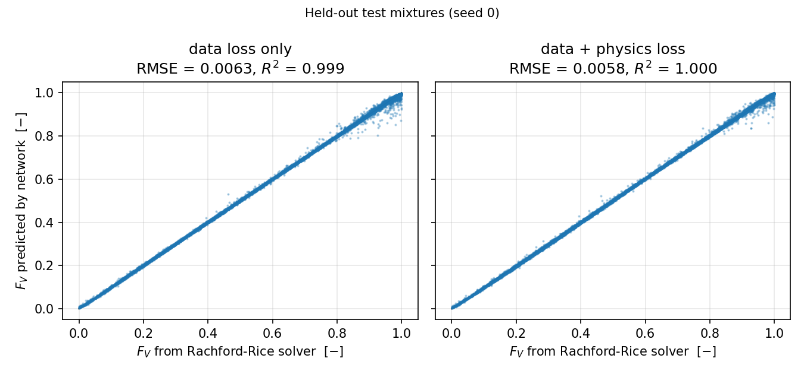
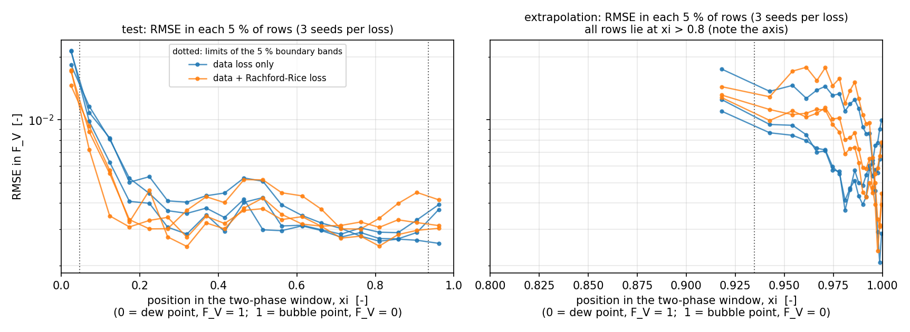

# A neural surrogate for the two-phase flash calculation

**CHEN60492 *Properties of Subsurface Fluids* + the Deep Learning module,
University of Manchester** — MSc coursework, extended and re-verified in 2026.

## Supervisor overview

**Question.** In reservoir and CO₂-storage simulation, the two-phase flash —
how much of a hydrocarbon mixture is vapour at a given pressure and
temperature — is solved again and again. Neural networks are often proposed
to replace that iterative step. This project tests the idea on the flash the
module teaches. **Can a neural surrogate reproduce it for mixtures it has never
seen, where does it fail, and when does adding the Rachford-Rice residual to
the loss improve prediction?**

**Physical reference.** The reference is the module's own calculation. Wilson
K-values are computed from the printed seven-component table (CO₂, C1–C5, C10;
notes pp. 14–15) and fed into Rachford-Rice, which is solved by bisection.
The solver reproduces the notes' worked examples: saturation pressures to
1.3e−7 and 3.6e−6 relative, and the p. 15 flash to 1.6e−5 in `F_V`. This is a
**synthetic benchmark**. Every label comes from that calculation, and nothing
here is checked against measurements or claims to describe real
vapour–liquid equilibrium.

**Data and split.** There are 60,000 two-phase states from 3,000 generated
mixtures (`z_i = n_i / Σ n_j`, the notes' own construction) at 2–2000 psia and
150–220 °F. They are split **by mixture**: 1,800 / 600 / 600 for training,
validation and test, with no mixture in two parts. Standardisation uses
training rows only. A separate set of 401 mixtures at 2000–4000 psia tests
pressure extrapolation.

**Deep-learning approaches.** The network is the course's feed-forward
network: 9 inputs (seven mole fractions, `p`, `T`), three hidden layers and a
sigmoid output for `F_V`. It is trained either on the data loss alone, or on
the data loss plus `λ·mean[h(F_V)²]`, the Rachford-Rice residual of its own
prediction — the physics-informed loss of the course's SciML lecture. There
are three seeds per variant, and checkpoints are chosen on validation data.

**Measured findings.**
* **Accuracy.** Test RMSE in `F_V` is 0.00636 ± 0.00026 with the data loss and
  **0.00535 ± 0.00029 with the physics loss**, against 0.279 for predicting the
  training mean. The ± is the spread over three seeds, not a confidence
  interval.
* **Where it fails.** The errors cluster next to the **dew point**. The 5 % of
  test rows nearest it hold **45–58 % of the squared error** and most of the
  worst 1 % of errors. The bubble-point side holds 0.7–2.6 %.
* **When the physics loss helps.** In range it helped in **all three seeds**
  (−8 %, −15 %, −24 % RMSE). How much of that came from the dew band varies
  by seed (135 %, 17 %, 64 %). On the 2000–4000 psia extrapolation set it was
  **worse in two of three seeds** (+19 %, +82 %; −25 % in the third).
* **Capacity.** A bounded comparison froze its configuration and selection
  rule before scoring, then tested 3 × 64, 3 × 128 and 3 × 192 hidden units on
  the data loss. The validation rule **selected 3 × 64**: a quarter of the
  original's parameters, with the same test error (0.00638 against 0.00636).
  The wider network was slightly worse. The original 3 × 128 benchmark is
  kept, and the physics-loss result applies to that width only.
* **Guarded prediction.** The sigmoid gives a plausible-looking fraction for
  any input. For example, the bare network calls an all-vapour state 92 %
  vapour. The public `FlashSurrogate` now:
  * validates the input;
  * applies the course's phase test first;
  * uses the network only for two-phase states inside its training ranges;
  * otherwise falls back, with a label, to the reference solver.

**Limitations.** Synthetic labels from one correlation and one fixed component
set. The equation-of-state route is a separate future study. The domain checks
are marginal (one variable at a time). The evidence is three seeds, and
speed is not a benefit: bisection is already fast.

**Quickest commands** (from this folder; nothing is retrained):

```bash
pip install -r requirements.txt        # or requirements-ci.txt: the pinned CPU-only set CI uses
python scripts/verify_flash.py         # reference solver vs the notes' worked examples
python tests/run_tests.py              # 48 tests
python scripts/evaluate.py --out-dir check --fig-dir check   # re-scores the six saved models
python scripts/compare_results.py results/metrics/evaluation.json check/evaluation.json --expect-count 185
jupyter notebook notebooks/flash_surrogate.ipynb   # the whole study, with saved outputs
```

Details: [error analysis](docs/ERROR_ANALYSIS.md) ·
[capacity](docs/CAPACITY.md) · [guarded prediction](docs/GUARDED_PREDICTION.md)
· [verification](docs/VERIFICATION.md) · [limitations](docs/LIMITATIONS.md) ·
[sources](docs/SOURCE_MAP.md) · [review checklist](docs/REVIEW_CHECKLIST.md).

---

## 1. Scope and sources

* **Ground truth is a model, not data.** The notes give Wilson's original
  validity as below 500 psia and then apply it in their own worked examples up
  to 4000 psia. This project follows the notes, so the correlation *defines*
  the target.
* **Only the Wilson route.** The equation-of-state route is named in the notes
  (p. 6) without any equation of state being written down. It is outside the
  scope chosen here, and comparing against one would be a separate study.
* **Constants as printed.** The component constants are used exactly as
  printed in the module's table, not checked against or corrected by any
  outside source.
* **Fixed component set.** One set of seven components in varying
  proportions. The network is never told what the components are.

| input | value | source |
|---|---|---|
| seven components with `Pc` (psia), `Tc` (R), acentric factor | `src/sfp/components.py` | `Models/3 - Two-phase flash calculation.pdf`, pp. 14–15 |
| K-values | `K_i = (p_ci/p)·exp[5.37(1+ω_i)(1 − T_ci/T)]` | same file, p. 4 and p. 14 |
| Rachford-Rice, phase test, phase compositions, bubble/dew points | `h(F_V) = Σ z_i(K_i−1)/[F_V(K_i−1)+1] = 0` | same file, pp. 2, 7, 8, 11–13 |
| composition rule | `z_i = n_i / Σ n_j` from integer mole charges | same file, p. 2 and p. 14 |
| pressure / temperature window | 610–680 R (150–220 °F), 2–4000 psia | span of the states printed on pp. 14–18 |
| network, training loop, standardisation | `simpleFFN`, `train`/`validate`, `apply_standardization` | `Day01-Intro_DL_FFNs_and_Colab_morning_solutions.ipynb`, cells 21–41 |
| physics-informed loss | data MSE + `λ·mean[h(NN(x))²]` | `Day13-SciML_morning.pdf`, slide 37 |

No external dataset, property table or equation of state is used.
[`docs/SOURCE_MAP.md`](docs/SOURCE_MAP.md) traces each item to a page or cell
and lists every project choice. The 2026 revision adds one statistical method
from outside the course material, a resampling of test mixtures, used only to
describe evaluation-set dependence (§5 there). The reference solver's
agreement with the three worked examples is in
[`docs/VERIFICATION.md`](docs/VERIFICATION.md).

## 2. The original benchmark (September 2026, unchanged)

60,000 two-phase states from 3,000 mixtures, split by mixture: 36,000 / 12,000 /
12,000 rows (1,800 / 600 / 600 mixtures). The extrapolation set has 7,931 rows
from 401 mixtures at 2000–4000 psia. `simpleFFN`, 9 → 3 × 128 → 1 (34,433
parameters), Adam, 200 epochs, three seeds per variant.

| model | test RMSE | test R² | extrapolation RMSE | extrapolation R² |
|---|---|---|---|---|
| training-mean `F_V` (baseline) | 0.27869 | −0.000 | 0.56222 | −68.71 |
| FFN, data loss only | 0.00636 ± 0.00026 | 0.99948 | **0.00835 ± 0.00197** | 0.9838 |
| FFN, data + Rachford-Rice loss | **0.00535 ± 0.00029** | 0.99963 | 0.00972 ± 0.00197 | 0.9783 |

Mean over seeds 0, 1, 2 and the population standard deviation (`ddof = 0`);
the spread measures training-run variability only. Every number is in
`results/metrics/evaluation.json` (185 values, per seed and summarised). In
October 2026 these were reproduced **bit for bit** from the saved dataset and
models ([`results/original_2026-09-21/`](results/original_2026-09-21/)).



## 3. What the 2026 extension found

* **Errors by window position** ([`docs/ERROR_ANALYSIS.md`](docs/ERROR_ANALYSIS.md)).
  Each row's position in its two-phase window is `ξ = ln(p/p_d)/ln(p_b/p_d)`,
  from the notes' Wilson bubble and dew points: 0 at the dew point, 1 at the
  bubble point.
  * The 5 % of test rows nearest the dew point hold 45–58 % of the squared
    error (data loss; 41–56 % with the physics loss) and 56–78 % of each
    model's worst 1 % of errors. Their RMSE is 3.6 to 5.1 times that of the
    middle 90 %.
  * Seed by seed, the physics loss lowered the test error by 8.3, 15.1 and
    23.8 %. Over 2,000 resamplings of the test mixtures, the central 95 % of
    each difference stays below zero.
  * On extrapolation the same comparison gave +18.6, −25.3 and +81.8 %.
  * Every extrapolation row lies near the bubble point (`ξ > 0.8`). There the
    error grows *away* from the boundary.
* **Capacity** ([`docs/CAPACITY.md`](docs/CAPACITY.md)).

  | width | parameters | best validation MSE | test RMSE | extrapolation RMSE | s / epoch |
  |---|---|---|---|---|---|
  | 3 × 64 (**selected**) | 9,025 | 5.16e−05 | 0.00638 | 0.0073 | 0.86 |
  | 3 × 128 (original) | 34,433 | 5.62e−05 | 0.00636 | 0.0084 | 1.08 |
  | 3 × 192 | 76,225 | 5.72e−05 | 0.00672 | 0.0097 | 1.27 |

  The selection rule — the smallest width within 10 % of the best mean
  validation MSE — was committed before any of these models was scored. The
  test set, already published for 3 × 128, is reported as an established
  benchmark, not used to choose.
* **Guarded prediction** ([`docs/GUARDED_PREDICTION.md`](docs/GUARDED_PREDICTION.md)).
  The domain was checked against the training data. Pressure (≤ 2000 psia) and
  temperature (610–680 R) match the earlier review's limits. Composition does
  not: the generator permits 0.004–0.87 per component, but the training rows
  contain only up to 0.43–0.48, so the realised ranges are used.



## 4. Using the guarded predictor

```python
import sys; sys.path.insert(0, "src")
from sfp.predict import FlashSurrogate
s = FlashSurrogate()                                   # default: validation-best saved model
r = s.predict([0.0387597, 0.1937984, 0.0775194, 0.1162791, 0.1085271, 0.1550388, 0.3100775],
              796.43821, 640.0)                        # mole fractions, psia, degrees Rankine
print(r.FV, r.phase, r.method)                         # 0.1923 two_phase network
```

The `method` field says what produced the value: `network`,
`single_phase`, `phase_boundary`, `reference_solver_fallback`,
`network_extrapolation` (only on request) or `none`. Malformed input raises
`InputError`. Nothing is normalised or converted silently.

## 5. Reproduce and check

* **Check the recorded results** (about a minute; no training): the commands in
  the overview. CI (`.github/workflows/subsurface-dl.yml`) runs them on every
  change to this folder. It uses Python 3.11 with the pinned CPU-only PyTorch
  2.14.0 (`requirements-ci.txt`).
  * It runs the flash verification, all tests, the evaluation of the six
    saved models, the training-domain derivation, the guarded-prediction cases,
    the error analysis and the capacity scoring.
  * It compares every number with the recorded files, including the 185
    original metrics, with `rtol = 1e-6` and `atol = 1e-6`.
  * Statuses, keys and labels must match exactly. Timings, timestamps and
    figure pixels are excluded.
  * The tolerances are measured, not guessed.
    `scripts/ulp_sensitivity.py` moves every float32 prediction by one and
    three units in the last place and records how far each number moves
    (`results/reproducibility/`).
* **Rebuild everything from nothing** (the recorded training runs alone add up
  to about an hour on 2–4 CPU cores, no GPU): `bash scripts/run_all.sh`. It regenerates the dataset, retrains the
  six original and six capacity models, and reruns every analysis.
  `configs/experiment.json` and `configs/capacity.json` hold the settings.
* **Environments.** `requirements.txt` gives the packages. `requirements-lock.txt`
  and `environment.yml` give the versions of the recorded 2026-09-21 run.
  `requirements-ci.txt` is the pinned CPU-only set.

## 6. Limitations

Summarised; the full list is [`docs/LIMITATIONS.md`](docs/LIMITATIONS.md).

* Synthetic benchmark: no measurements, no claim about real VLE or field
  accuracy.
* The EoS route to K-values is outside the chosen scope.
* The component constants are used exactly as printed, including three that
  look unusual.
* One fixed component set. The network covers two-phase states only, and the
  guarded predictor handles everything else.
* The extrapolation set is **selected**: at 2000–4000 psia many mixtures have
  no two-phase state.
* Three seeds show whether an effect exceeds seed scatter. They are not a
  significance test.
* The guarded predictor's domain checks are marginal.
* The capacity comparison covers one depth and three widths; the physics loss
  was tested at 3 × 128 only.
* Speed is not the reason to build this surrogate. On 12,000 test states,
  bisection takes about 30 ms and one forward pass about 3–21 ms, depending on
  width and machine load.

## 7. Version history

| version | date | what it is |
|---|---|---|
| Coursework | during the MSc | the project for CHEN60492 *Properties of Subsurface Fluids* and the Deep Learning module |
| Rebuilt and published | run 2026-09-21, published 2026-09-27 | rebuilt on the course sources alone (Wilson table, notes' composition rule). Six models and 185 metrics (`results/original_2026-09-21/` identifies them) |
| **Extended and re-verified** | **2026-10-04** | baseline reproduced bit for bit, then extended: guarded prediction, error analysis across the two-phase window, bounded capacity comparison, project CI with measured tolerances. No original result was changed or retrained |

Two earlier versions were superseded during the September rebuild, and an
earlier CO₂-storage version used external reference data. None of them is in
this repository (`docs/LIMITATIONS.md` §8).

## 8. Repository layout

```
notebooks/flash_surrogate.ipynb   the whole study, executed, with outputs
src/sfp/components.py, flash.py   the component table; Wilson, Rachford-Rice, phase test, bubble/dew points
src/sfp/data.py, nn.py            dataset, split by mixture, scaler; simpleFFN, training loop, physics term
src/sfp/predict.py                the guarded public prediction path
scripts/verify_flash.py           reference solver vs the notes' worked examples
scripts/make_dataset.py, train.py, learning_curve.py, evaluate.py   the original study
scripts/derive_domain.py, guarded_demo.py, analyse_errors.py, capacity.py   the 2026 extension
scripts/compare_results.py, ulp_sensitivity.py   numerical comparison and its tolerances
configs/                          experiment, capacity (frozen) and prediction-domain settings
data/flash_dataset.npz            dataset with mixture index and split
results/checkpoints/, metrics/, figures/   the original six models, metrics and figures 1-5
results/analysis/, capacity/, guarded/, reproducibility/, figures/fig6-9   the 2026 extension
results/original_2026-09-21/      hashes of the original files and the record of their reproduction
tests/                            48 tests: tests/run_tests.py (or pytest)
docs/                             verification, error analysis, capacity, guarded prediction,
                                  limitations, source map, review checklist
```

The course material is not in this repository; it is cited by page and cell.

## 9. Author and attribution

Abdelghafar Fouda — MSc Subsurface Energy Engineering, University of
Manchester.

The flash model, the component table and the worked examples come from the
CHEN60492 *Properties of Subsurface Fluids* notes (Dr Masoud Babaei, University
of Manchester); the notes credit their seven-component example (pp. 14–15) to
a Texas A&M PETE 310 spreadsheet. The network, training loop and
standardisation follow the Deep Learning module's PyTorch notebooks, and the
physics-informed loss follows its *Introduction to Scientific Machine Learning*
slides (Dr Ben Moseley). No teaching material is redistributed here;
[`docs/SOURCE_MAP.md`](docs/SOURCE_MAP.md) cites each item.

Every number in this README is produced by the scripts named above and
checked by CI.
NumPy, PyTorch, Matplotlib and Jupyter are used under their own open-source
licences.

Licence: MIT (see [`LICENSE`](LICENSE)).
