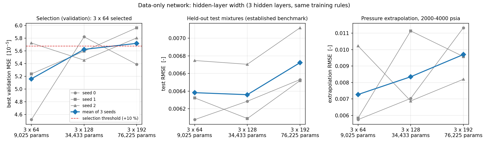

# Network capacity: is 3 × 128 hidden units a sensible choice?

`configs/capacity.json` (frozen) · `scripts/capacity.py` ·
`results/capacity/` · `results/figures/fig9_capacity.png`

## 1. Design, fixed before scoring

The original network has three hidden layers of 128 units (34,433
parameters). The original learning curve showed that more training mixtures
helped at that width; it could not say whether the width itself was right.
This bounded comparison adds two widths and nothing else:

* **Widths.** 3 × 64, 3 × 128 and 3 × 192 hidden units; the data-only loss;
  seeds 0, 1, 2.
* **Training.** The same split by mixture, standardisation fitted on training
  rows, Adam with `lr = 1e-3`, batch 64, 200 epochs, `nn.MSELoss`, and
  checkpoint at the lowest validation data MSE — the rules of the original
  runs, with 2 torch threads as in the recorded run.
* **Reuse.** The three original 3 × 128 data-only runs were reused after
  `python scripts/capacity.py provenance` matched all 36 recorded settings
  (`results/capacity/provenance_128.json`). Six new runs were trained, the
  stated maximum.
* **Selection rule.** The smallest width whose mean (over seeds) best
  validation MSE is no more than 10 % above the lowest. 10 % in MSE is about
  5 % in RMSE, several times the 2.7 % seed-to-seed spread of the original
  runs' validation MSE. **Test data play no part.** The test set is an
  *established benchmark*: its 3 × 128 results were published before this
  comparison, so it is not a fresh holdout.
* **Freeze.** The configuration, the scoring script and the reuse check were
  committed (`d7cd786`) before any new model was trained or any capacity model
  was scored on the test or extrapolation sets.

## 2. Results

| | 3 × 64 | 3 × 128 (original) | 3 × 192 |
|---|---|---|---|
| parameters | 9,025 | 34,433 | 76,225 |
| best validation MSE, mean ± std over seeds | **5.16e−05** ± 0.50e−05 | 5.62e−05 ± 0.15e−05 | 5.72e−05 ± 0.24e−05 |
| per seed (0, 1, 2) | 4.52, 5.24, 5.73 e−05 | 5.82, 5.60, 5.46 e−05 | 5.39, 5.96, 5.80 e−05 |
| test RMSE (established benchmark) | 0.00638 ± 0.00028 | 0.00636 ± 0.00026 | 0.00672 ± 0.00028 |
| test R² | 0.99948 | 0.99948 | 0.99942 |
| test mean Rachford-Rice `h²` | 5.7e−04 | 6.0e−04 | 6.5e−04 |
| extrapolation RMSE (2000–4000 psia) | 0.0073 ± 0.0021 | 0.0084 ± 0.0020 | 0.0097 ± 0.0013 |
| seconds per epoch, one machine, back to back | 0.86 | 1.08 | 1.27 |
| inference, 12,000 test rows, 2 threads | about 3 ms | about 11 ms | about 21 ms |

`±` is the population standard deviation over seeds 0, 1, 2: variability
between training runs, not a confidence interval. Timings are from
`results/capacity/` on the 4-CPU cloud container of the revision. They move
with machine load: an earlier scoring run gave 2.8, 10.7 and 17.9 ms. The
per-run training wall times are recorded too (`training_wall_seconds`), but
they come from different machines and loads — the original 128-unit runs on
2 vCPUs, the new runs two at a time on 4 — so only the back-to-back
seconds-per-epoch measurement compares the widths fairly.

**Training and validation behaviour.** No width shows a training–validation
gap that would indicate overfitting. In every run the epoch-averaged
training MSE at the selected epoch is comparable to or higher than the best
validation MSE (`runs.*.train_mse_at_best_epoch` against `best_val_mse`). The
validation MSE fluctuates strongly from epoch to epoch at the fixed learning
rate: the original 3 × 128 seed-0 run ends at 3.2e−04 against its best of
5.8e−05. So the checkpoint rule matters as much as the width. The selected
epochs range from 141 to 189 of 200.

## 3. Reading

* **The rule selects 3 × 64** (`selection.selected_width`). It has the lowest
  mean validation MSE, and is the smallest network. 3 × 128 is also within
  the 10 % margin; 3 × 192 is not.
* **A larger network offers no benefit here.** On the established test
  benchmark 3 × 64 and 3 × 128 are indistinguishable (0.00638 against 0.00636,
  well inside one seed spread), and 3 × 192 is slightly worse. The 3 × 64
  network does this with a quarter of the parameters, about 80 % of the
  training time per epoch, and roughly a quarter of the inference time.
* On pressure extrapolation the mean RMSE rises with width (0.0073, 0.0084,
  0.0097), but the seed spread (0.0013–0.0021) is as large as the
  differences. That is a tendency, not an established effect.
* **What changes.** For the data-only network the validated choice is
  3 × 64. The original 3 × 128 width was therefore larger than necessary, but
  not harmful in range.
* **What does not change.** The original 3 × 128 benchmark, its six models and
  its 185 metrics are kept as they were. The physics-loss comparison was run
  only at 3 × 128 and is **not** extended to other widths: whether the
  Rachford-Rice term helps a 3 × 64 network was not tested. The guarded
  predictor's default model is still chosen by validation MSE among the six
  reported models (`ffn_phys1_s2`, 4.05e−05, lower than any data-only run at
  any width).

## 4. Limits

* Three widths and one depth; no learning-rate, batch or epoch changes, and
  no other architecture. This answers "was 3 × 128 sensible?" and nothing
  broader.
* Three seeds per width. The validation spread of 3 × 64 (±0.50e−05) is
  larger than that of 3 × 128, so its advantage on validation is not firmly
  separated from training-run variability; the selection rule was fixed in
  advance precisely so that this does not have to be judged afterwards.
* Synthetic Wilson–Rachford-Rice labels only, as everywhere in this project.
