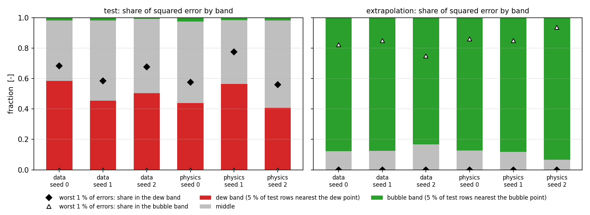
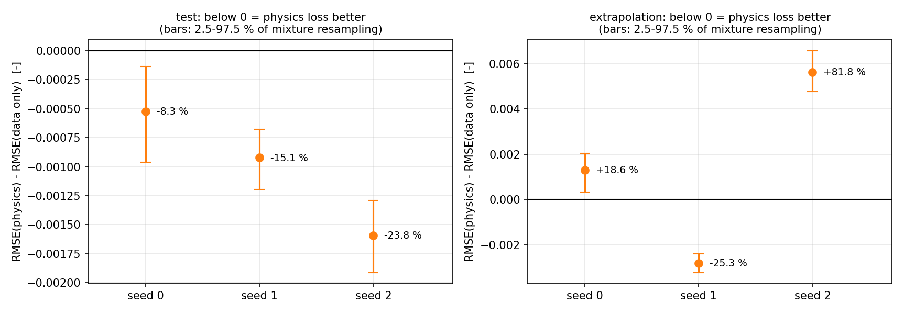

# Where the surrogate fails: error across the two-phase window

`python scripts/analyse_errors.py` → `results/analysis/` (JSON and CSV) and
`results/figures/fig6`–`fig8`. It uses the six saved models and the saved
dataset; nothing is retrained. Every number below is read from
`results/analysis/error_analysis.json` or the CSV tables beside it.

## 1. Position in the two-phase window

Wilson's `K_i` is proportional to `1/p` (notes p. 4), so the two sums of the
phase test are `Σ z_iK_i = p_b/p` and `Σ z_i/K_i = p/p_d`, with the bubble- and
dew-point pressures

```
p_b = Σ z_i p_ci exp[5.37(1 + ω_i)(1 − T_ci/T)]        (F_V = 0, notes p. 12)
p_d = 1 / Σ z_i / (p_ci exp[5.37(1 + ω_i)(1 − T_ci/T)])  (F_V = 1, notes p. 13)
```

— the same sums as the `Bpi` and `Dpi` columns of the p. 14 sheet
(`sfp.flash.wilson_saturation_pressures`). A state is two-phase exactly when
`p_d < p < p_b`. Its position in that window is measured in log pressure:

```
xi = ln(p / p_d) / ln(p_b / p_d)
```

**Direction:** `xi = 0` at the dew point (all vapour, `F_V = 1`) and `xi = 1` at
the bubble point (all liquid, `F_V = 0`); `xi` rises with pressure. Log
pressure is used because the windows span decades (the p. 14 mixture's runs
from 2.0 to 1590.9 psia).

**Boundary bands.** The 5 % of **test** rows with the smallest `xi` form the
*dew band* (`xi ≤ 0.0464`, mean `F_V` 0.977) and the 5 % with the largest the
*bubble band* (`xi ≥ 0.9346`, mean `F_V` 0.076); the remaining 90 % are the
*middle*. The same `xi` limits are applied to the extrapolation set, so "near
the dew point" means the same thing in both sets.

## 2. Test set (600 held-out mixtures, 12,000 rows)

| model | RMSE | MAE | 95th / 99th pct \|error\| | max \|error\| | mean `h²` | dew band: RMSE, share of squared error, share of worst 1 % | bubble band: RMSE, share of squared error |
|---|---|---|---|---|---|---|---|
| data, seed 0 | 0.00629 | 0.00307 | 0.0086 / 0.0235 | 0.129 | 4.9e−04 | 0.0215, **58 %**, 68 % | 0.0039, 1.9 % |
| data, seed 1 | 0.00609 | 0.00324 | 0.0096 / 0.0239 | 0.142 | 5.9e−04 | 0.0183, **45 %**, 58 % | 0.0037, 1.9 % |
| data, seed 2 | 0.00670 | 0.00362 | 0.0107 / 0.0266 | 0.137 | 7.3e−04 | 0.0213, **50 %**, 68 % | 0.0026, 0.7 % |
| physics, seed 0 | 0.00576 | 0.00341 | 0.0089 / 0.0205 | 0.122 | 3.8e−04 | 0.0171, **44 %**, 58 % | 0.0041, 2.6 % |
| physics, seed 1 | 0.00517 | 0.00268 | 0.0076 / 0.0180 | 0.122 | 3.0e−04 | 0.0173, **56 %**, 78 % | 0.0030, 1.7 % |
| physics, seed 2 | 0.00511 | 0.00291 | 0.0083 / 0.0194 | 0.110 | 3.2e−04 | 0.0146, **41 %**, 56 % | 0.0031, 1.9 % |

`h` is the Rachford-Rice function evaluated at the prediction (notes p. 8); it
is zero for an exact flash.

**What this shows.**

* **The errors are concentrated next to the dew point.** The 5 % of test rows
  nearest it hold **45–58 % of the squared error** of the data-only models (mean
  51 %) and 56–78 % of each model's worst 1 % of errors. Their RMSE, 0.015–0.022,
  is four to five times the RMSE elsewhere. This confirms the earlier
  observation that about half the squared error sits there.
* **The bubble-point side is not a problem area.** The 5 % of rows nearest the
  bubble point hold 0.7–2.6 % of the squared error and none of the worst 1 % of
  errors.
* The dew-band errors are where `F_V` is close to 1 and the sigmoid output is
  close to saturation. That is consistent with the cause, but this analysis does
  not establish the cause.




## 3. Data loss against data + Rachford-Rice loss, seed by seed

The physics term is compared with the data-only model of the **same seed**,
on the same rows (`results/analysis/physics_vs_data_only.csv`).

| set | seed | RMSE change | mixture resampling, 2.5–97.5 % of the RMSE difference | share of the change in squared error in the dew / middle / bubble band |
|---|---|---|---|---|
| test | 0 | **−8.3 %** | −9.6e−04 to −1.3e−04 | 135 % / −33 % / −1 % |
| test | 1 | **−15.1 %** | −1.19e−03 to −6.8e−04 | 17 % / 81 % / 2 % |
| test | 2 | **−23.8 %** | −1.91e−03 to −1.29e−03 | 64 % / 37 % / −1 % |
| extrapolation | 0 | **+18.6 %** | +3.3e−04 to +2.03e−03 | 0 / 14 % / 86 % (an increase) |
| extrapolation | 1 | **−25.3 %** | −3.23e−03 to −2.41e−03 | 0 / 13 % / 87 % |
| extrapolation | 2 | **+81.8 %** | +4.75e−03 to +6.57e−03 | 0 / 2 % / 98 % (an increase) |

**What this supports.**

* **In range, the physics loss helped in all three seeds** (−8.3 %, −15.1 %,
  −23.8 %). For each seed, resampling the test mixtures leaves the difference
  on the same side of zero.
* **Where the improvement came from depends on the seed.** In seed 0 the dew
  band accounts for more than all of it (135 %, while the middle got slightly
  worse). In seed 2 it accounts for 64 %, and in seed 1 for only 17 %. "Most of
  the physics-loss improvement occurs near the dew point" therefore holds in
  two of the three seeds, not in general.
* **On pressure extrapolation the physics loss was worse in two of three
  seeds** (+18.6 %, +81.8 %) and better in one (−25.3 %). The negative result
  of the original study stands.
* **What the two spreads measure.** The resampling interval measures only how
  much a comparison of two fixed trained models depends on which mixtures are
  in the evaluation set. It is not a confidence interval for training a new
  model. The differences between seeds measure training-run variability.
  In range they are comparable to the resampling intervals; on extrapolation
  they are many times larger. Three seeds are too few to turn that into a
  probability.



## 4. Pressure-extrapolation set (401 mixtures, 7,931 rows, 2000–4000 psia)

* **Every extrapolation row lies in the upper part of its window** (`xi` from
  0.81 to 1.0, median 0.985): at 2000–4000 psia only mixtures with high bubble
  points are still two-phase, and they are close to them. None is in the dew
  band; 95 % (7,524 rows) are in the bubble band, with mean `F_V` 0.05.
* Those bubble-band rows hold 83–93 % of the squared error, slightly *less*
  than their 95 % share of rows. The remaining 5 % of rows (`xi` 0.81–0.93,
  mean `F_V` 0.25) hold 7–17 %. So within this set the error rises away from the
  bubble point, which is the opposite of the in-range pattern (figure 6, right).
* Extrapolation RMSE per model is 0.0069–0.0125, against 0.0051–0.0067 in
  range, and differs by up to a factor of 1.6 between seeds of the same loss.

## 5. Composition outside the training ranges

180 test rows — 9 mixtures — and 100 extrapolation rows have a mole fraction
outside the range seen in training (`configs/prediction_domain.json`). The
network's RMSE on those test rows (0.0043–0.0057) is **not larger** than on the
others. So the guarded predictor's composition check is conservative here. It
flags states it cannot vouch for, not states shown to fail
([`GUARDED_PREDICTION.md`](GUARDED_PREDICTION.md)).

## 6. Limits of this analysis

* It locates the error; it does not explain it.
* `xi` is defined with the same Wilson K-values that define the labels, so it
  describes the benchmark's own geometry, not any real fluid.
* It covers the six reported 3 × 128 models only. The capacity comparison
  ([`CAPACITY.md`](CAPACITY.md)) reports overall errors for the other widths.
