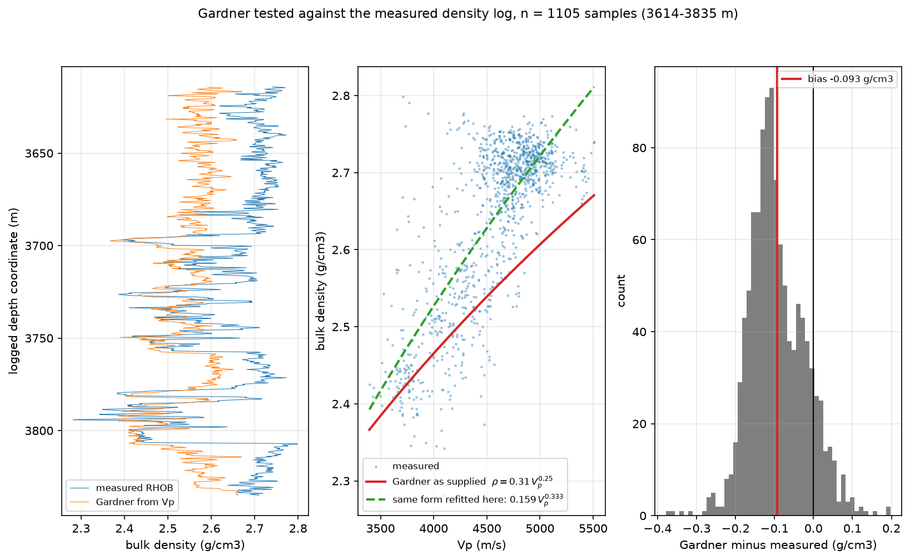
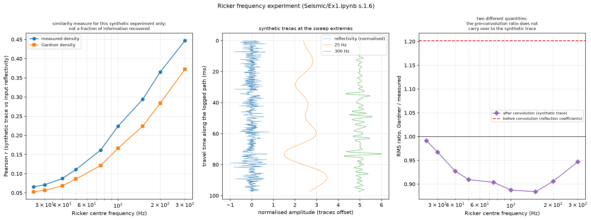

# SeisGeoMech

**Does the Gardner relation hold at well 48/10b-9, and what does its error do to a ρg gradient?**

A small, fully source-traceable study linking one seismic method to one geomechanical consequence.

The seismic practical teaches you to predict density from velocity with Gardner's relation when you
have no density log. The geomechanics notes give the overburden relation `d(sigma_zz)/dz = rho g`,
which integrates that same density. So a density prediction made for a synthetic seismogram is also
a statement about stress. This project tests the prediction where a measurement exists and follows
the error into both subjects.

---

## Result in one paragraph

Over the 221 m of well 48/10b-9 where the sonic and density logs overlap (1,105 samples,
3,614–3,835 m), the Gardner relation as supplied — `rho = 0.31 Vp^0.25` — **under-predicts bulk
density by 0.093 g/cm³, a systematic 3.5 %**, with an RMS error of 0.118 g/cm³. Because the
supplied overburden model integrates that same density, the error transfers exactly: a ρg gradient
of **24.97 against 25.89 MPa/km**, 0.91 MPa/km lower. On the seismic side the same substitution
makes acoustic impedance a function of velocity alone (`Z = 0.31 Vp^1.25`), which preserves the
shape of the **reflection-coefficient series** — correlation 0.935 — while raising its RMS by 20 %;
after wavelet convolution the **synthetic-trace** RMS ratio is 0.88–0.99, below one at every
frequency tested, so the two ratios are different quantities and behave differently. Refitting the
same functional form to these 1,105 points gives `rho = 0.159 Vp^0.333` and lowers RMSE by 41.5 %
on the very data it was fitted to — an in-sample description of these samples, not a prediction
test.

---

## Two things the numbers depend on

**The logged depth coordinate is not established as vertical.** The depth curve is labelled `DEPT`,
which by itself says nothing about the convention. The file has no TVD curve, no deviation survey,
`LMF` ("logs measured from") is `UNKNOWN`, and every elevation and water-depth field is zero; the
only statement about depth convention in the supplied material names the measured-depth /
true-vertical-depth distinction without resolving it. The absolute ρg gradients below are therefore
reported as an explicitly **one-dimensional application of the supplied model** to the logged
coordinate — not as a verified field stress profile, and the two-way times are travel time along
the logged path, not vertical TWT and not a seismic tie. No trajectory is obtained, invented or
assumed. `las_io.depth_convention_evidence()` prints the evidence, saved to
`results/tables/depth_convention_evidence.csv`; a test asserts every vertical-depth and trajectory
curve is still absent.

**The measured-versus-Gardner difference is invariant under uniform coordinate scaling.** Both
density profiles are integrated over the same coordinate array, so multiplying every interval by
one constant factor rescales both integrals identically and cancels from their ratio. That is
verified numerically: a uniform rescaling leaves the ratio unchanged to 1.3e−15.

That claim is deliberately narrow. It does **not** establish invariance under a depth-dependent
trajectory correction, which would reweight the two integrals sample by sample; since the Gardner
density is not a constant multiple of the measured density, such a correction would in general
change the ratio. A test asserts that limit explicitly. No trajectory correction is applied, and
the gradient calculations keep their one-dimensional qualification throughout.

---

## Data

One dataset, copied unmodified from the module's seismic practical folder:
`data/raw/48_10b-_9_jwl_JWL_FILE_1682139.las` — UK well **48/10b-9**, southern North Sea, operator
BP, spudded 1990-08-26. LAS 2.0, 18,975 depth samples, NULL = −999.25.

Two facts about that file set the shape of the whole project:

* `RHOB` is logged over only ~236 m near total depth (about 6 % of the well), while `DT` covers
  766–3,835 m. Their **221 m overlap (1,105 samples)** is the only place Gardner can be tested
  against a measurement.
* There is **no shear sonic (`DTS`)**, so K and G cannot be separated and no Young's modulus,
  Poisson's ratio or horizontal stress is computed for this well anywhere.

Two further datasets are used only to verify the elasticity code, and are transcribed from the
module's exercise sheet rather than measured here: the olivine stiffness tensor (Q3) and the
Merivale granite uniaxial-compression record (Q4). Measured log data, synthetic calculations and
these worked examples are kept separate throughout.

## Methods

| Step | What is done |
|---|---|
| Read the log | `lasio`, rejecting only the header NULL; no caliper or DRHO cut-off, because the material supplies no threshold |
| Velocity | `Vp = 10⁶ × 0.3048 / DT` — the definition of the logged unit µs/ft, not a model |
| Gardner test | `rho = 0.31 Vp^0.25` evaluated against measured `RHOB` over the 1,105 paired samples |
| Refit | the same functional form refitted to those points — an **in-sample calibration** |
| ρg gradient | `d(sigma_zz)/dz = rho g` integrated along the logged coordinate, with measured and Gardner density in turn |
| Forward model | `Z = rho·Vp`, `R = (Z₂−Z₁)/(Z₂+Z₁)`, Ricker wavelet, `np.convolve` |
| Frequency sweep | 25–300 Hz, reporting Pearson similarity **and**, separately, synthetic-trace RMS |
| Elasticity | `M = rho Vp² = K + 4G/3` — the only elastic modulus this well supports |
| Verification | the two supplied worked examples, plus analytical identities and unit checks |

Every one of these is traced to a specific page, section or notebook cell in `SOURCE_MAP.md`.

---

## Headline numbers

| Quantity | Value |
|---|---|
| Overlap interval where Gardner can be tested | 3,614.2 – 3,835.0 m, 1,105 samples |
| Gardner bias vs measured density | **−0.0932 g/cm³ (−3.53 %)** |
| Gardner RMSE | 0.1179 g/cm³ |
| Correlation, Vp vs measured RHOB | 0.758 |
| Same form refitted, **in-sample** on these points | `rho = 0.159 Vp^0.333`, RMSE 0.0690 g/cm³ (41.5 % lower on the calibration data) |
| ρg gradient, measured density (1-D application) | **25.887 MPa/km** |
| ρg gradient, Gardner density (1-D application) | **24.973 MPa/km** |
| Gradient difference (invariant under uniform coordinate scaling) | **−0.914 MPa/km (−3.53 %)** |
| P-wave modulus `M = rho Vp²` over the overlap | 28.0 – 83.1 GPa (mean 55.9) |
| Reflection-coefficient RMS ratio, **before** convolution | 1.202 |
| Synthetic-trace RMS ratio, **after** convolution | 0.884 – 0.991 across the tested frequencies |
| Reflection-coefficient correlation, Gardner vs measured | 0.935 |
| Pearson r, synthetic trace vs input reflectivity | 0.066 at 25 Hz to 0.447 at 300 Hz (similarity measure for this experiment only) |
| Verification — olivine VRH (Models Q3) | K 129.45, G 77.97 GPa; Vp 8,341 m/s, Vs 4,821 m/s |
| Verification — Merivale granite (Models Q4) | E 99.95 GPa, ν 0.2534; Vp 6,750 m/s, Vs 3,879 m/s |

All of these are regenerated by `python scripts/run_all.py` and written to `results/`.



*Gardner's relation against the measured density log over the 1,105 paired samples: the profile
comparison, the Vp–density crossplot with the supplied and refitted curves, and the residual
distribution with its −0.093 g/cm³ bias.*



*The wavelet-frequency experiment. Left: Pearson similarity between the synthetic trace and its
input reflectivity — a similarity measure for this synthetic experiment only. Right: the two RMS
ratios that must not be conflated — 1.202 on the reflection coefficients before convolution, but
0.88–0.99 on the synthetic traces after it.*

### How to read the Pearson r

It is the linear correlation between a synthetic trace and the reflectivity series that produced
it, inside this synthetic experiment. It is **not** a fraction of the log's information,
variability or structure recovered, and neither is its square: it compares a broadband input with a
band-limited output of that same input, so it is not a decomposition of anything. It ranks
frequencies against each other here and does nothing else. No quarter-wavelength or tuning rule is
supplied, so it is not converted into a bed thickness, and it supports no claim about what a field
survey would image — no field seismic data are used anywhere in this project.

---

## What each subject contributes

| | contribution |
|---|---|
| **Seismic** | the Gardner relation; acoustic impedance; normal-incidence reflection coefficients; the Ricker wavelet and convolution; the wavelet-frequency experiment; and the LAS file itself |
| **Models** | `d(sigma_zz)/dz = rho g`; the uniaxial-strain result `sigma_xx = nu/(1−nu) sigma_zz`; the link between elastic moduli and Vp/Vs; and the two worked examples that verify the elasticity code |

The connection is one-directional: a seismic-side density model feeds a mechanics-side ρg gradient,
because they are the same `rho`. Nothing is forced in the other direction.

---

## Reproducing the results

Python 3.10 or newer (verified on 3.10.12 and 3.11.15).

```bash
cd SeisGeoMech
python -m venv .venv
source .venv/bin/activate          # Windows: .venv\Scripts\activate
pip install -r requirements.txt
```

or, with conda:

```bash
conda env create -f environment.yml
conda activate seisgeomech
```

## Run

```bash
python scripts/run_all.py
```

Writes 12 CSV tables plus `summary.json` to `results/tables/`, and 6 figures to
`results/figures/`, in about 3 seconds.

```bash
python -m pytest tests -q
```

126 tests, about 3 seconds.

The single starting notebook is:

```bash
jupyter lab notebooks/SeisGeoMech.ipynb
```

It runs top to bottom in the order
**purpose → supplied inputs → assumptions → calculations → verification → results → limitations**,
and is the recommended entry point.

Everything in `results/` is generated by that one command; nothing is committed by hand.

**Reproducibility.** The workflow has been run in three independent environments — Python 3.11.15
and Python 3.10.12 on Linux, and a fresh virtual environment built from `requirements.txt` alone.
Every scalar in `results/tables/summary.json` agreed to the last bit across all three, and all
twelve CSV tables regenerate byte-identically. The PNG figures differ by a few pixels of bounding
box between Matplotlib versions, which is a rendering detail rather than a numerical one. The exact
environment that produced the published results, and the pinned versions, are recorded in
`results/tables/environment.txt` and `requirements-lock.txt`.

---

## Layout

```
SeisGeoMech/
├── README.md                  this file
├── SOURCE_MAP.md              every equation, dataset and constant, with its exact source
├── notebooks/SeisGeoMech.ipynb   the one starting notebook
├── scripts/run_all.py         regenerates every table and figure
├── src/seisgeomech/
│   ├── units.py               unit definitions and standard gravity
│   ├── las_io.py              reads the supplied LAS; reports coverage and depth-convention evidence
│   ├── elasticity.py          isotropic constants, VRH averaging, Vp and Vs
│   ├── stress.py              rho g integration along the logged coordinate, uniaxial-strain ratio
│   ├── seismic.py             Gardner, impedance, reflectivity, Ricker, frequency sweep
│   ├── worked_examples.py     olivine (Q3) and Merivale granite (Q4)
│   ├── analysis.py            the seven-stage workflow
│   └── figures.py             presentation only
├── tests/                     126 tests
├── data/raw/                  the supplied LAS file, unmodified
└── results/                   generated tables and figures
```

---

## Source rule

Every scientific equation, parameter, dataset and method in this project is traceable to a specific
page, section or notebook cell in the two supplied teaching folders (`Models/` and `Seismic/`).
`SOURCE_MAP.md` gives the reference for each one, lists the design choices that are *not* scientific
assumptions, records what was removed and why, and states the genuine source gaps.

Nothing is imported from outside those folders: no external property table, correlation, paper or
dataset; no assumed rock property; no invented scenario; no well trajectory. Where the data run
out, the project says so rather than filling the gap. Tests in `tests/test_workflow.py` guard this
mechanically, including guards against re-introducing an information-recovered reading of the
correlation and against any field-seismic calibration claim.

---

## Scope: what is implemented, and what is not

Everything in the **Headline numbers** table is computed by the code in this repository and
regenerated by `python scripts/run_all.py`. Nothing in this project is a placeholder, a stub or a
figure copied in by hand.

**Implemented and verified here**

| | |
|---|---|
| LAS reading, QC and curve-coverage reporting | `src/seisgeomech/las_io.py` |
| Gardner's relation tested against the measured density log, 1,105 paired samples | `results/tables/gardner_vs_rhob.csv` |
| In-sample refit of the same functional form | `summary.json` → `gardner_refit_*` |
| ρg integration along the logged coordinate, measured vs Gardner density | `results/tables/rho_g_profile.csv` |
| P-wave modulus `M = rho Vp²` profile | `results/tables/p_wave_modulus_profile.csv` |
| Acoustic impedance, normal-incidence reflectivity, Ricker convolution | `results/tables/impedance_and_reflectivity.csv` |
| Wavelet-frequency sweep, 25–300 Hz, similarity **and** synthetic-trace RMS | `results/tables/resolution_sweep.csv` |
| Depth-convention audit of the supplied LAS | `results/tables/depth_convention_evidence.csv` |
| Olivine (Q3) and Merivale granite (Q4) worked examples | `results/tables/worked_example_*.csv` |
| 126 tests, including analytical identities and source-compliance guards | `tests/` |

**Deliberately not implemented** — each would need a measurement or a source the module material
does not supply, so none of it is attempted, approximated or presented as a result:

| Not done | Why |
|---|---|
| Young's modulus, Poisson's ratio, Vs or horizontal stress for this well | no shear sonic (`DTS`) in the supplied LAS; `M` is the only modulus Vp and density can give |
| Effective stress | no pore-pressure measurement and no mud weight; the law is coded in `stress.effective_stress` and never called, and a test enforces that |
| Absolute vertical stress, or a true-vertical-depth conversion | density is unlogged above 3,614 m, and the file establishes no depth convention — only increments and gradients are reported, with a one-dimensional qualification |
| Lithology, porosity or facies | no GR cut-off and no matrix density are supplied |
| Held-out validation of the Gardner refit | paired sonic and density samples exist only over the 221 m overlap |
| A resolvable bed thickness | no quarter-wavelength or tuning rule is supplied, so the frequency sweep is reported as a similarity measure only |
| NMO, semblance, migration, AVO, attributes, seismic-to-well tie | those practicals use SEG-Y volumes and CMP gathers that are not part of the supplied material; no field seismic data are used anywhere |

**Possible extensions, not claimed as results.** A shear sonic log would close the largest gap and
make E, ν and the uniaxial-strain horizontal stress computable at this well; a deviation survey
would settle the depth convention; paired sonic and density data from a second well would allow an
out-of-sample test of the refit. None of these are attempted here, and no part of the repository
assumes them.

---

## Limitations

1. **The test interval is 221 m near total depth** — 6 % of the well, one lithological setting.
   Everything said about Gardner's performance is measured there, and no extrapolation beyond the
   logged interval is offered.
2. **No shear sonic.** Without Vs, K and G cannot be separated, so no E, ν or horizontal stress is
   computed for this well. `sigma_h/sigma_v = nu/(1−nu)` is shown parametrically only. This is the
   single measurement that would most extend the project.
3. **No pore pressure, no mud weight.** All stresses are total. The effective stress law is
   implemented and deliberately never called.
4. **No absolute vertical stress** — density is unlogged above 3,614 m, so only integrals and
   gradients are reported.
5. **No lithology or porosity** — no GR cut-off and no matrix density are supplied.
6. **No hole-condition filtering** — CALI and DRHO are reported, not applied, because no threshold
   is supplied. Some residual scatter may be borehole effect rather than model error.
7. **Gardner's unit convention is inferred**, then confirmed against measurement; `Ex1.ipynb` does
   not state it.
8. **The frequency-sweep metric is a similarity measure, not a resolution limit** — see *How to
   read the Pearson r* above.
9. **Zero-offset, normal incidence only.** No NMO, migration, AVO or attribute work; no field
   seismic data anywhere, so no seismic-to-well tie and no amplitude calibration.
10. **The depth convention is unresolved**, so absolute gradients are a one-dimensional application
    of the supplied model rather than a field stress profile. The measured-versus-Gardner difference
    is unaffected. A deviation survey would resolve this.
11. **The Gardner refit is in-sample.** No samples were held out; the coefficients were fitted and
    evaluated on the same 1,105 paired samples.
12. **One well.** This establishes what Gardner does at 48/10b-9 between 3,614 and 3,835 m, and
    nothing more general.

---

## Licence and attribution

Code, documentation and generated results in this folder are released under the MIT Licence — see
[`LICENSE`](LICENSE). Author: **Abdelghafar Fouda**.

**Data attribution.** `data/raw/48_10b-_9_jwl_JWL_FILE_1682139.las` is a public-domain UK
continental-shelf well log (well 48/10b-9, operator BP, spudded 1990-08-26), supplied with the
module's seismic practical material and redistributed here unmodified so that the workflow runs
without external downloads. See [`data/raw/README.md`](data/raw/README.md).

**Teaching material.** No course teaching material is redistributed in this repository. The
`Models` and `Seismic` folders referenced throughout `SOURCE_MAP.md` are the University of
Manchester EART35102 notes, exercises and practical notebooks; `SOURCE_MAP.md` cites the specific
page, section or notebook cell behind every equation, dataset and constant without reproducing any
of it.

Module: **Subsurface Mechanics and Geoengineering**, MSc Subsurface Energy Engineering,
University of Manchester.
