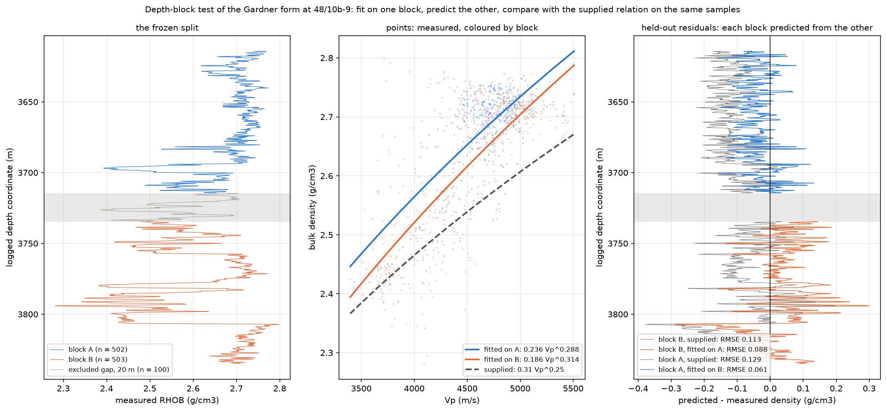

# Does a locally fitted Gardner relation predict a separate depth interval?

`configs/depth_blocks.json` (frozen) · `src/seisgeomech/depth_blocks.py` ·
`scripts/depth_blocks.py` · `results/depth_blocks/` · `tests/test_depth_blocks.py`

The original refit fitted `rho = a Vp^b` to all 1,105 paired samples and scored it on
the same samples (RMSE 0.0690 against 0.1179 g/cm³ for the supplied relation). That
describes those samples and predicts nothing. The earlier statement that "no
out-of-sample test is possible" was too broad. Validation on **another well** is not
possible, because the supplied material has paired sonic and density logs for this one
well only. A **within-well** test is possible: fit on one depth block and predict
another. This file reports that test.

## 1. Design, frozen before scoring

| | |
|---|---|
| samples | the 1,105 paired samples of the original workflow, sorted by the logged coordinate `DEPT_M` |
| split | the midpoint of the overlap, 3,724.6 m. Samples within 10 m of it are excluded, a 20 m gap. **A** is above the gap, **B** below |
| directions | fit on A and predict B; fit on B and predict A |
| fit | `numpy.polyfit(log Vp, log RHOB, 1)` on the training block only. This is the method, units (m/s, g/cm³) and functional form of the original refit |
| reference | the supplied `rho = 0.31 Vp^0.25` on exactly the same evaluation samples |
| metrics | bias, RMSE and MAE (g/cm³). The reduction is `100 (supplied − block fit) / supplied`, so positive means the block fit has the lower error |
| reading rule | **Better** only if held-out RMSE and MAE are both lower; **worse** only if both are higher; otherwise **mixed**. Each direction is read on its own and never pooled |
| consequence | the mean ρg gradient over each evaluation block, with measured, supplied and block-fitted density |

The design and the derived split were committed in `193eb36` (preceded by the
work-in-progress commit `251ae90`). Scores were first computed after the freeze and committed
in `3bea7e9`. No held-out score was computed or committed before `193eb36`: the pre-freeze
reviewers were instructed not to score, and the tests score only synthetic data. The
work-in-progress tree `251ae90` had no such protection. `run_all.py` could already have scored
it, and its configuration was already labelled "frozen". Both gaps were found by the review and
closed in `193eb36`. Since then, `depth_blocks.score` refuses to run unless the configuration is
marked frozen and the split derived from the data matches the frozen identifiers, and a test pins
the configuration's hash.

Before the freeze, an AI-run review (Claude, at the author's direction) reported 29 issues in
the draft design and code. All were fixed in `193eb36`, whose commit message summarises them.
The review itself is not committed.

**The split** (`results/depth_blocks/split.json`, `split_samples.csv`):

| block | samples | LAS rows | logged coordinate (m) | Vp (m/s), range and mean |
|---|---|---|---|---|
| A | 502 | 17,795–18,296 | 3,614.20 – 3,714.40 | 3,395 – 5,508, mean 4,688 |
| excluded | 100 | 18,297–18,396 | 3,714.60 – 3,734.40 | 3,797 – 4,968 |
| B | 503 | 18,397–18,899 | 3,734.60 – 3,835.00 | 3,497 – 5,505, mean 4,473 |

The last A sample and the first B sample are 20.2 m apart. Both gap edges lie within
1.6e−5 m of a sample. The overlap is sampled every 0.2 m, and the midpoint falls on a sample.
So the exact metre values put one edge sample in the gap and the other in B, giving 100
excluded samples rather than 101. The per-sample assignment in `split_samples.csv`, with
its SHA-256 identifiers, is the frozen split.

**What the gap is and is not.** The ~20 m gap was specified in the task brief, which based
it on an earlier review's estimate (not recorded here) of how far the residuals stay correlated
along the log. No block fit or held-out score informed it. It is a design choice and does not
make the blocks independent. It is measured along the logged coordinate, whose vertical
convention the file does not establish. As context, computed after the gap was fixed, the
residuals are still correlated at 20 m: 0.08 for the supplied relation and 0.10 for the
in-sample refit. At 40 m the values are 0.14 and 0.12 (`residual_lag_correlation.csv`). The
two blocks are adjacent parts of one 221 m interval.

## 2. Results

| direction | fitted on the training block | n | held-out bias | RMSE | MAE | reading |
|---|---|---|---|---|---|---|
| A → B | `rho = 0.2362 Vp^0.2875` | 503 | +0.036 | **0.088** | 0.069 | block fit better |
| | supplied `0.31 Vp^0.25`, same samples | 503 | −0.076 | 0.113 | 0.092 | |
| B → A | `rho = 0.1859 Vp^0.3143` | 502 | −0.035 | **0.061** | 0.050 | block fit better |
| | supplied, same samples | 502 | −0.119 | 0.129 | 0.120 | |

All values are in g/cm³. Every number is in `results/depth_blocks/depth_block_results.json`
and `depth_block_table.csv`, and the per-sample predictions are in
`depth_block_predictions.csv`.

**Reading.** In both directions the locally fitted coefficients predict the other block
better than the supplied coefficients do: RMSE 22 % and 53 % lower, and MAE 25 % and
58 % lower. Under the frozen rule the overall reading is *block fit better*. Most of the
gain is the removal of the supplied relation's bias, −0.076 and −0.119 g/cm³ on the two
blocks.

**What it does not show.**
* **The two blocks are not described by the same coefficients.** The exponents are 0.288
  and 0.314. Each block fit mis-predicts the other block by about 0.035 g/cm³ (1.3–1.4 %),
  with opposite signs. Even within this 221 m interval, a calibration carries a bias of
  that size to the adjacent 100 m.
* **The held-out error depends on which block is predicted.** For A → B, the held-out
  RMSE of 0.088 is 1.8 times the in-block fit of 0.050. For B → A, the held-out RMSE of
  0.061 is lower than the in-block fit of 0.080, because block B is more scattered (its
  low-density beds at about 3,780–3,800 m).
* **Both relations share the functional form.** A *better* reading shows that fitted
  coefficients transfer better than the supplied ones over this interval. It is not
  evidence that the form is correct, and it says nothing about other depths or wells.
* Velocity ranges overlap closely, so the test involves almost no extrapolation in
  velocity. Four of the 502 predictions in B → A lie outside B's velocity range, and none in
  A → B lies outside A's.

## 3. What the density errors do to the ρg calculation

The mean ρg gradient over each evaluation block is computed along the logged coordinate.
Like the original gradients, it is an **explicitly one-dimensional application** of
`d(sigma_zz)/dz = rho g`, not a verified vertical stress gradient. The differences between
densities share one coordinate array, so they are unaffected by a uniform rescaling of it.

| evaluation block | measured | supplied relation | block fit |
|---|---|---|---|
| B (fit on A) | 25.582 MPa/km | 24.832 (−0.750, −2.93 %) | 25.934 (+0.353, +1.38 %) |
| A (fit on B) | 26.314 MPa/km | 25.144 (−1.170, −4.44 %) | 25.971 (−0.342, −1.30 %) |

Over the whole overlap, the supplied relation's gradient is 0.914 MPa/km (3.53 %) below
the measured one. Over each block it is 0.75 and 1.17 MPa/km low. A relation calibrated on
the adjacent 100 m cuts that error to about 0.35 MPa/km, but not to zero, and its sign
depends on the direction. Because the gradient is linear in density, the percentage
gradient error matches the percentage density bias to within 0.01 percentage points in every
case. They differ slightly because the trapezoidal integration weights the end samples of
each block by half, unlike a plain mean.

## 4. Limits

* One well and one 221 m interval near total depth. The blocks are adjacent and the 20 m
  gap does not make them independent.
* Two directions are two numbers, not a distribution. No confidence interval is
  attached, and none is claimed.
* The coordinate is the logged one. The gap, the block lengths and the gradients are
  measured along it.
* No hole-condition filtering, as in the original workflow. Part of the scatter may be
  borehole effect.
* The test was pre-specified but not blind. The per-sample residuals of the whole overlap
  had been published on 2026-09-27, before the design. The midpoint rule and the ~20 m gap
  come from the task brief, and no block-fitted coefficient or held-out prediction existed
  before the freeze commit.
